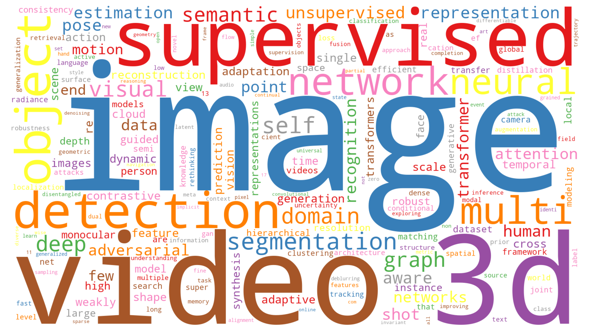

# ICCV-2021-Papers 最新论文和代码汇总(PapersWithCode)

### 【📣 ICCV 2021录用论文列表发布了！】

> 注0：欢迎各位同学Star，分享ICCV-2021的Paper和Code！
>
> 注1：历年ICCV论文汇总，详见： https://github.com/TensorLabX/ICCV2025-PapersWithCode
>

***

欢迎扫码关注公众号【**Tensor实验室**】，获取最新**大模型、具身智能、CV、扩散模型、多模态、自动驾驶、医疗影像、AIGC、遥感等方向的论文解读、发展趋势和学习资料**，赶快加入一起学习吧！

## AI垂直方向交流群和论文投稿群已成立！

## 👨‍🔧👩‍🔧👨‍🔬👩‍🔬👨‍🚀👨‍🚒🕵️‍: 欢迎进群 | Welcome

目前已经开设的AI细分垂直方向交流群包括但不限于：**大模型、多模态、具身智能、CV、扩散模型、目标检测、图像分割、目标跟踪、医学影像、遥感、3DGS、Mamba、NeRF、Transformer、GAN、异常检测/缺陷检测、SLAM、人脸检测&识别、OCR、NAS、Re-ID、超分辨率、强化学习、3D重建、姿态估计、自动驾驶、活体检测、深度估计、去噪、显著性目标检测、车道线检测、模型剪枝&压缩、去雾、去雨、行为识别、视频理解、图像融合、图像检索等**。

可以添加微信小助手微信：**Tensor333**或**Tensor555**，请备注：**研究方向+地区+学校/公司名称+昵称**！如：**大模型+北京+北航+小北**；一定要根据格式申请，可以拉你进对应的交流群。

**如果目前方向未定的的同学，可以先加入大群（大群和垂直方向群可以同时加入）**。可以添加微信小助手微信：**Tensor333**或**Tensor555**，请备注：**方向未定+地区+学校/公司名称+昵称**！如：**方向未定+北京+北航+小北**；

***
**如果想进顶刊顶会论文投稿和交流群的同学。**可以添加微信小助手微信：**Tensor333**或**Tensor555**，请备注：**顶刊顶会名称+地区+学校/公司名称+昵称**！如：**CVPR+北京+北航+小北**；
***

## 📙: **【论文目录】**

- [Backbone](#Backbone)
- [Dataset](#dataset)
- [Loss](#loss)
- [NAS](#NAS)
- [Image Classification](#Image-Classification)
- [Vision Transformer](#VisualTransformer)
- [目标检测/Object Detection](#ObjectDetection)
- [显著性检测/Salient Object Detection](#Salient-Object-Detection)
- [3D目标检测 / 3D Object Detection](#3D-Object-Detection)
- [目标跟踪 / Object Tracking](#ObjectTracking)
- [Image Semantic Segmentation](#ImageSemanticSegmentation)
- [Semantic Scene Segmentation](#Semantic-Scene-Segmentation)
- [3D Semantic Segmentation](#3D-Semantic-Segmentation)
- [3D Instance Segmentation](#3D-Instance-Segmentation)
- [实例分割/Instance Segmentation](#InstanceSegmentation)
- [视频分割 / video semantic segmentation](#video-semantic-segmentation)
- [医学图像分割/ Medical Image Segmentation](#MedicalImageSegmentation)
- [医学图像分析/Medical Image Analysis](#Medical-Image-Analysis)
- [GAN](#GAN)
- [Style Transfer](#Style-Transfer)
- [细粒度分类/Fine-Grained Visual Categorization](#Fine-Grained-Visual-Categorization)
- [Multi-Label Recognition](#Multi-Label-Recognition)
- [Long-Tailed Recognition](#Long-Tailed-Recognition)
- [Geometric deep learning](#GeometricDeepLearning)
- [Zero/Few Shot](#ZeroFewShot)
- [Unsupervised](#Unsupervised)
- [Self-supervised](#Self-supervised)
- [Semi Supervised](#Semi-Supervised)
- [Weakly Supervised](#Weakly-Supervised)
- [Active Learning](#Active-Learning)
- [Action Detection](#Action-Detection)
- [动作识别/Action Recognition](#HumanActions)
- [时序行为检测 / Temporal Action Localization](#TemporalActionLocalization)
- [手语识别/Sign Language Recognition](#SignLanguageRecognition)
- [Hand Pose Estimation](#Hand-Pose-Estimation)
- [Pose Estimation](#PoseEstimation)
- [6D Object Pose Estimation](#6D-Object-Pose-Estimation)
- [Human Reconstruction](#Human-Reconstruction)
- [3D Scene Understanding](#3D-Scene-Understanding)
- [人脸识别/Face Recognition](#Face-Recognition)
- [人脸对齐/Face Alignment](#Face-Alignment)
- [人脸编辑/Facial Editing](#Facial-Editing)
- [Face Reconstruction](#FaceReconstruction)
- [Facial Expression Recognition](#Facial-Expression-Recognition)
- [行人重识别/Re-Identification](#Re-Identification)
- [Vehicle Re-identification](#VehicleRe-identification)
- [Pedestrian Detection](#Pedestrian-Detection)
- [人群计数 / Crowd Counting](#Crowd-Counting)
- [Motion Forecasting](#MotionForecasting)
- [Pedestrian Trajectory Prediction](#Pedestrian-Trajectory-Prediction)
- [Face-Anti-spoofing](#Face-Anti-spoofing)
- [deepfake](#deepfake)
- [对抗攻击/ Adversarial Attacks](#AdversarialAttacks)
- [跨模态检索/Cross-Modal Retrieval](#Cross-Modal-Retrieval)
- [神经辐射场/NeRF](#NeRF)
- [阴影去除/Shadow Removal](#Shadow-Removal)
- [图像检索/Image Retrieval](#ImageRetrieval)
- [超分辨/Super-Resolution](#Super-Resolution)
- [图像重建/Image Reconstruction](#ImageReconstruction)
- [去模糊/Image Deblurring](#Deblurring)
- [去噪/Image Denoising](#ImageDenoising)
- [去雪/Image Desnowing](#ImageDesnowing)
- [图像增强/Image Enhancement](#ImageEnhancement)
- [图像匹配/Image Matching](#Image-Matching)
- [图像质量/Image Quality](#Image-Quality )
- [图像压缩/Image Compression](#Image-Compression)
- [图像复原/Image Restoration](#Image-Restoration)
- [图像修复/Image Inpainting](#Image-Inpainting)
- [视频修复/Video Inpainting](#VideoInpainting)
- [视频插帧/Video Frame Interpolation](#VideoFrameInterpolation)
- [Video Reasoning](#Video-Reasoning)
- [Video Recognition](#Video-Recognition)
- [Visual Question Answering](#Visual-Question-Answering)
- [Matching](#Matching)
- [人机交互/Hand-object Interaction](#Hand-object-Interaction)
- [视线估计 / Gaze Estimation](#GazeEstimation)
- [深度估计 / Depth Estimation](#DepthEstimation)
- [Contrastive-Learning](#Contrastive-Learning)
- [Graph Convolution Networks](#Graph-Convolution-Networks)
- [模型压缩/Compress](#Compress)
- [Quantization](#Quantization)
- [Knowledge Distillation](#Knowledge-Distillation)
- [点云/Point Cloud](#pointcloud)
- [3D reconstruction](#3D-reconstruction)
- [字体生成/Font Generation](#FontGeneration)
- [文本检测 / Text Detection](#TextDetection)
- [文本识别 / Text Recognition](#TextRecognition)
- [Scene Text Recognizer](#SceneTextRecognizer)
- [Autonomous-Driving](#Autonomous-Driving)
- [Visdrone_detection](#Visdrone_detection)
- [异常检测 / Anomaly Detection](#AnomalyDetection)
- [其他/Others](#Others)

## Backbone

:heavy_check_mark:**Conformer: Local Features Coupling Global Representations for Visual Recognition**

- 🌈Paper：https://arxiv.org/abs/2105.03889
- 👉Code：https://github.com/pengzhiliang/Conformer

**Contextual Convolutional Neural Networks**

- 🌈Paper：https://arxiv.org/abs/2108.07387
- 👉Code：https://github.com/iduta/coconv

**Pyramid Vision Transformer: A Versatile Backbone for Dense Prediction without Convolutions**

- 🌈Paper：https://arxiv.org/abs/2102.12122
- 👉Code：https://github.com/whai362/PVT

**Reg-IBP: Efficient and Scalable Neural Network Robustness Training via Interval Bound Propagation**

- 🌈Paper：None
- 👉Code：https://github.com/harrywuhust2022/Reg_IBP_ICCV2021

**Why Approximate Matrix Square Root Outperforms Accurate SVD in Global Covariance Pooling?**

- 🌈Paper：https://arxiv.org/abs/2105.02498
- 👉Code：https://github.com/KingJamesSong/DifferentiableSVD

[返回目录/back](#Contents)

## Dataset

**Beyond Road Extraction: A Dataset for Map Update using Aerial Images**

- 🌈Paper：https://arxiv.org/abs/2110.04690
- 👉Code： None

:heavy_check_mark:**FineAction: A Fined Video Dataset for Temporal Action Localization**

- 🌈Paper：https://arxiv.org/abs/2105.11107 | [主页/Homepage](https://deeperaction.github.io/fineaction/)
- 👉Code： None

**KoDF: A Large-scale Korean DeepFake Detection Dataset**

- 🌈Paper：https://arxiv.org/abs/2103.10094
- 👉Code：https://moneybrain-research.github.io/kodf

**LLVIP: A Visible-infrared Paired Dataset for Low-light Vision**

- 🌈Paper：https://arxiv.org/abs/2108.10831 | [主页/Homepage](https://bupt-ai-cz.github.io/LLVIP/)
- 👉Code： None

**Matching in the Dark: A Dataset for Matching Image Pairs of Low-light Scenes**

- 🌈Paper：https://arxiv.org/abs/2109.03585
- 👉Code： None

**Meta Self-Learning for Multi-Source Domain Adaptation: A Benchmark**

- 🌈Paper：https://arxiv.org/abs/2108.10840 | [主页/Homepage](https://bupt-ai-cz.github.io/Meta-SelfLearning/)
- 👉Code：https://github.com/bupt-ai-cz/Meta-SelfLearning

:heavy_check_mark:**MultiSports: A Multi-Person Video Dataset of Spatio-Temporally Localized Sports Actions**

- 🌈Paper：https://arxiv.org/abs/2105.07404 | [主页/Homepage](https://deeperaction.github.io/multisports/)
- 👉Code：https://github.com/MCG-NJU/MultiSports/

**Semantically Coherent Out-of-Distribution Detection**

- 🌈Paper：https://arxiv.org/abs/2108.11941 | [主页/Homepage](https://jingkang50.github.io/projects/scood)
- 👉Code：https://github.com/jingkang50/ICCV21_SCOOD

**StereOBJ-1M: Large-scale Stereo Image Dataset for 6D Object Pose Estimation**

- 🌈Paper：https://arxiv.org/abs/2109.10115
- 👉Code：None

**STRIVE: Scene Text Replacement In Videos**

- 🌈Paper：https://arxiv.org/abs/2109.02762 | [主页/Homepage](https://striveiccv2021.github.io/STRIVE-ICCV2021/)
- 👉Code：None

**The Many Faces of Robustness: A Critical Analysis of Out-of-Distribution Generalization**

- 🌈Paper：https://arxiv.org/abs/2006.16241
- 👉Code：https://github.com/hendrycks/imagenet-r

**Webly Supervised Fine-Grained Recognition: Benchmark Datasets and An Approach**

- 🌈Paper：https://arxiv.org/abs/2108.02399
- 👉Code：https://github.com/NUST-Machine-Intelligence-Laboratory/weblyFG-dataset

**Who's Waldo? Linking People Across Text and Images** (Oral)

- 🌈Paper：https://arxiv.org/abs/2108.07253
- 👉Code：None

[返回目录/back](#Contents)

## Loss

**Asymmetric Loss For Multi-Label Classification**

- 🌈Paper：https://arxiv.org/abs/2009.14119
- 👉Code：https://github.com/Alibaba-MIIL/ASL

**Bias Loss for Mobile Neural Networks**

- 🌈Paper：https://arxiv.org/abs/2107.11170
- 👉Code：None

**Focal Frequency Loss for Image Reconstruction and Synthesis**

- 🌈Paper：https://arxiv.org/abs/2012.12821
- 👉Code：https://github.com/EndlessSora/focal-frequency-loss

**Orthogonal Projection Loss**

- 🌈Paper：https://arxiv.org/abs/2103.14021
- 👉Code：https://github.com/kahnchana/opl

**Rank & Sort Loss for Object Detection and Instance Segmentation** (Oral)

- 🌈Paper：https://arxiv.org/abs/2107.11669
- 👉Code：https://github.com/kemaloksuz/RankSortLoss

[返回目录/back](#Contents)

## NAS

**BN-NAS: Neural Architecture Search with Batch Normalization**

- 🌈Paper：https://arxiv.org/abs/2108.07375
- 👉Code：None

**BossNAS: Exploring Hybrid CNN-transformers with Block-wisely Self-supervised Neural Architecture Search**

- 🌈Paper：https://arxiv.org/pdf/2103.12424.pdf
- 👉Code：https://github.com/changlin31/BossNAS

**CONet: Channel Optimization for Convolutional Neural Networks**

- 🌈Paper：https://arxiv.org/abs/2108.06822
- 👉Code：None

**FOX-NAS: Fast, On-device and Explainable Neural Architecture Search**

- 🌈Paper：https://arxiv.org/abs/2108.08189
- 👉Code：https://github.com/great8nctu/FOX-NAS

**Pi-NAS: Improving Neural Architecture Search by Reducing Supernet Training Consistency Shift**

- 🌈Paper：https://arxiv.org/abs/2108.09671v1
- 👉Code：https://github.com/Ernie1/Pi-NAS

**RANK-NOSH: Efficient Predictor-Based Architecture Search via Non-Uniform Successive Halving**

- 🌈Paper：https://arxiv.org/abs/2108.08019
- 👉Code：https://github.com/ruocwang

**Single-DARTS: Towards Stable Architecture Search**

- 🌈Paper：https://arxiv.org/abs/2108.08128
- 👉Code：https://github.com/PencilAndBike/Single-DARTS.git

[返回目录/back](#Contents)

## Image Classification

**Influence-Balanced Loss for Imbalanced Visual Classification**

- 🌈Paper：https://arxiv.org/abs/2110.02444
- 👉Code：None

**Low-Shot Validation: Active Importance Sampling for Estimating Classifier Performance on Rare Categories**

- 🌈Paper：https://arxiv.org/abs/2109.05720
- 👉Code：None

**Tune It or Don't Use It: Benchmarking Data-Efficient Image Classification**

- 🌈Paper：https://arxiv.org/abs/2108.13122
- 👉Code：None

[返回目录/back](#Contents)

## Vision Transformer

**An End-to-End Transformer Model for 3D Object Detection**

- 🌈Paper：https://arxiv.org/abs/2109.08141
- 👉Code：None

**AutoFormer: Searching Transformers for Visual Recognition**

- 🌈Paper：https://arxiv.org/abs/2107.00651
- 👉Code：https://github.com/microsoft/AutoML

**BossNAS: Exploring Hybrid CNN-transformers with Block-wisely Self-supervised Neural Architecture Search**

- 🌈Paper：https://arxiv.org/pdf/2103.12424.pdf
- 👉Code：https://github.com/changlin31/BossNAS

**Conditional DETR for Fast Training Convergence**

- 🌈Paper：https://arxiv.org/abs/2108.06152
- 👉Code：https://git.io/ConditionalDETR

**Dyadformer: A Multi-modal Transformer for Long-Range Modeling of Dyadic Interactions**

- 🌈Paper：https://arxiv.org/abs/2109.09487
- 👉Code：None

**Eformer: Edge Enhancement based Transformer for Medical Image Denoising**

- 🌈Paper：https://arxiv.org/abs/2109.08044
- 👉Code：None

**Fast Convergence of DETR with Spatially Modulated Co-Attention**

- 🌈Paper：https://arxiv.org/abs/2108.02404
- 👉Code：https://github.com/gaopengcuhk/SMCA-DETR

**FuseFormer: Fusing Fine-Grained Information in Transformers for Video Inpainting**

- 🌈Paper：https://arxiv.org/abs/2108.01912
- 👉Code：None

**Generic Attention-model Explainability for Interpreting Bi-Modal and Encoder-Decoder Transformers**  (Oral)

- 🌈Paper：https://arxiv.org/pdf/2103.15679.pdf
- 👉Code：https://github.com/hila-chefer/Transformer-MM-Explainability

**GroupFormer: Group Activity Recognition with Clustered Spatial-Temporal Transformer**

- 🌈Paper：https://arxiv.org/abs/2108.12630
- 👉Code：https://github.com/xueyee/GroupFormer

**HiFT: Hierarchical Feature Transformer for Aerial Tracking**

- 🌈Paper：https://arxiv.org/abs/2108.00202
- 👉Code：https://github.com/vision4robotics/HiFT

**High-Fidelity Pluralistic Image Completion with Transformers**

- 🌈Paper：https://arxiv.org/pdf/2103.14031.pdf | [主页/Homepage](http://raywzy.com/ICT/)
- 👉Code： https://github.com/raywzy/ICT

**Improving 3D Object Detection with Channel-wise Transformer**

- 🌈Paper：https://arxiv.org/abs/2108.10723
- 👉Code：None

**Is it Time to Replace CNNs with Transformers for Medical Images?**

- 🌈Paper：https://arxiv.org/abs/2108.09038
- 👉Code：None

**Learning Spatio-Temporal Transformer for Visual Tracking**

- 🌈Paper：https://arxiv.org/abs/2103.17154
- 👉Code：https://github.com/researchmm/Stark

**MUSIQ: Multi-scale Image Quality Transformer**

- 🌈Paper：https://arxiv.org/abs/2108.05997
- 👉Code：None

**Paint Transformer: Feed Forward Neural Painting with Stroke Prediction** (Oral)

- 🌈Paper：https://arxiv.org/abs/2108.03798
- 👉Code：https://github.com/Huage001/PaintTransformer

**PlaneTR: Structure-Guided Transformers for 3D Plane Recovery**

- 🌈Paper：https://arxiv.org/abs/2107.13108
- 👉Code： https://github.com/IceTTTb/PlaneTR3D

**PnP-DETR: Towards Efficient Visual Analysis with Transformers**

- 🌈Paper：https://arxiv.org/abs/2109.07036
- 👉Code：https://github.com/twangnh/pnp-detr

**Pose Transformers (POTR): Human Motion Prediction with Non-Autoregressive Transformers**

- 🌈Paper：https://arxiv.org/abs/2109.07531
- 👉Code：None

**PoinTr: Diverse Point Cloud Completion with Geometry-Aware Transformers**  (Oral)

- 🌈Paper：https://arxiv.org/abs/2108.08839
- 👉Code：https://github.com/yuxumin/PoinTr

**Pyramid Vision Transformer: A Versatile Backbone for Dense Prediction without Convolutions**

- 🌈Paper：https://arxiv.org/abs/2102.12122
- 👉Code：https://github.com/whai362/PVT

**Rethinking and Improving Relative Position Encoding for Vision Transformer**

- 🌈Paper：https://houwenpeng.com/publications/iRPE.pdf
- 👉Code：https://github.com/wkcn/iRPE-model-zoo

**Rethinking Spatial Dimensions of Vision Transformers**

- 🌈Paper：https://arxiv.org/abs/2103.16302
- 👉Code：https://github.com/naver-ai/pit

**Simpler is Better: Few-shot Semantic Segmentation with Classifier Weight Transformer**

- 🌈Paper：https://arxiv.org/abs/2108.03032
- 👉Code：https://github.com/zhiheLu/CWTfor-FSS

**SnowflakeNet: Point Cloud Completion by Snowflake Point Deconvolution with Skip-Transformer**

- 🌈Paper：https://arxiv.org/abs/2108.04444
- 👉Code：https://github.com/AllenXiangX/SnowflakeNet

**Spatial-Temporal Transformer for Dynamic Scene Graph Generation**

- 🌈Paper：https://arxiv.org/abs/2107.12309
- 👉Code：None

**SOTR: Segmenting Objects with Transformers**

- 🌈Paper：https://arxiv.org/abs/2108.06747
- 👉Code：https://github.com/easton-cau/SOTR

**Swin Transformer: Hierarchical Vision Transformer using Shifted Windows**

- 🌈Paper：https://arxiv.org/abs/2103.14030
- 👉Code：https://github.com/microsoft/Swin-Transformer

**Revisiting Stereo Depth Estimation From a Sequence-to-Sequence Perspective with Transformers**

- 🌈Paper：https://arxiv.org/abs/2011.02910
- 👉Code：https://github.com/mli0603/stereo-transformer

**The Animation Transformer: Visual Correspondence via Segment Matching**

- 🌈Paper：https://arxiv.org/abs/2109.02614
- 👉Code：None

**The Right to Talk: An Audio-Visual Transformer Approach**

- 🌈Paper：https://arxiv.org/abs/2108.03256
- 👉Code：None

**TPH-YOLOv5: Improved YOLOv5 Based on Transformer Prediction Head for Object Detection on Drone-captured Scenarios**

- 🌈Paper：https://arxiv.org/abs/2108.11539
- 👉Code：None

**TransFER: Learning Relation-aware Facial Expression Representations with Transformers**

- 🌈Paper：https://arxiv.org/abs/2108.11116
- 👉Code：None

**TransPose: Keypoint Localization via Transformer**

- 🌈Paper：https://arxiv.org/abs/2012.14214
- 👉Code：https://github.com/yangsenius/TransPose

:heavy_check_mark:**Tokens-to-Token ViT: Training Vision Transformers from Scratch on ImageNet**

- 🌈Paper：https://arxiv.org/abs/2101.11986

- 👉Code： https://github.com/yitu-opensource/T2T-ViT

:heavy_check_mark:**Visual Transformer with Statistical Test for COVID-19 Classification**

- 🌈Paper：https://arxiv.org/abs/2107.05334
- 👉Code： None

**Vision Transformer with Progressive Sampling**

- 🌈Paper：https://arxiv.org/abs/2108.01684
- 👉Code：https://github.com/yuexy/PS-ViT

**Visual Saliency Transformer**

- 🌈Paper：https://arxiv.org/abs/2104.12099
- 👉Code： https://github.com/nnizhang/VST

**Vision-Language Transformer and Query Generation for Referring Segmentation**

- 🌈Paper：https://arxiv.org/abs/2108.05565
- 👉Code：https://github.com/henghuiding/Vision-Language-Transformer

**Voxel Transformer for 3D Object Detection**

- 🌈Paper：https://arxiv.org/abs/2109.02497
- 👉Code： None

[返回目录/back](#Contents)

## 目标检测/Object Detection

**Active Learning for Deep Object Detection via Probabilistic Modeling**

- 🌈Paper：https://arxiv.org/abs/2103.16130
- 👉Code：None

**Boosting Weakly Supervised Object Detection via Learning Bounding Box Adjusters**

- 🌈Paper：https://arxiv.org/abs/2108.01499
- 👉Code：https://github.com/DongSky/lbba_boosted_wsod

**Change is Everywhere: Single-Temporal Supervised Object Change Detection in Remote Sensing Imagery**

- 🌈Paper：https://arxiv.org/abs/2108.07002
- 👉Code：https://github.com/Z-Zheng/ChangeStar

**Conditional Variational Capsule Network for Open Set Recognition**

- 🌈Paper： https://arxiv.org/abs/2104.09159

- 👉Code：https://github.com/guglielmocamporese/cvaecaposr

**DetCo: Unsupervised Contrastive Learning for Object Detection**

- 🌈Paper：https://arxiv.org/abs/2102.04803
- 👉Code： https://github.com/xieenze/DetCo

**DeFRCN: Decoupled Faster R-CNN for Few-Shot Object Detection**

- 🌈Paper：https://arxiv.org/abs/2108.09017
- 👉Code：None

**Deployment of Deep Neural Networks for Object Detection on Edge AI Devices with Runtime Optimization**

- 🌈Paper：https://arxiv.org/abs/2108.08166
- 👉Code：None

**Detecting Invisible People**

- 🌈Paper：https://arxiv.org/abs/2012.08419 | [主页/Homepage](http://www.cs.cmu.edu/~tkhurana/invisible.htm)
- 👉Code：None

**FMODetect: Robust Detection and Trajectory Estimation of Fast Moving Objects**

- 🌈Paper：None
- 👉Code：https://github.com/rozumden/FMODetect

**GraphFPN: Graph Feature Pyramid Network for Object Detection**

- 🌈Paper：https://arxiv.org/abs/2108.00580
- 👉Code：None

**Human Detection and Segmentation via Multi-view Consensus**

- 🌈Paper：None
- 👉Code：https://github.com/isinsukatircioglu/mvc

**MDETR : Modulated Detection for End-to-End Multi-Modal Understanding**

- 🌈Paper：https://arxiv.org/abs/2104.12763 | [主页/Homepage](https://ashkamath.github.io/mdetr_page/)
- 👉Code： https://github.com/ashkamath/mdetr

**Mutual Supervision for Dense Object Detection**

- 🌈Paper：https://arxiv.org/abs/2109.05986
- 👉Code：None

**Morphable Detector for Object Detection on Demand**

- 🌈Paper：https://arxiv.org/abs/2110.04917
- 👉Code：https://github.com/Zhaoxiangyun/Morphable-Detector

**Moving Object Detection for Event-based vision using Graph Spectral Clustering**

- 🌈Paper：https://arxiv.org/abs/2109.14979
- 👉Code：None

**Oriented R-CNN for Object Detection**

- 🌈Paper：https://arxiv.org/abs/2108.05699
- 👉Code：https://github.com/jbwang1997/OBBDetection

**Rank & Sort Loss for Object Detection and Instance Segmentation** (Oral)

- 🌈Paper：https://arxiv.org/abs/2107.11669
- 👉Code：https://github.com/kemaloksuz/RankSortLoss

**Reconcile Prediction Consistency for Balanced Object Detection**

- 🌈Paper：https://arxiv.org/abs/2108.10809
- 👉Code：None

**Seeking Similarities over Differences: Similarity-based Domain Alignment for Adaptive Object Detection**

- 🌈Paper：https://arxiv.org/abs/2110.01428
- 👉Code：None

**Towards Rotation Invariance in Object Detection**

- 🌈Paper：https://arxiv.org/abs/2109.13488
- 👉Code：None

**TOOD: Task-aligned One-stage Object Detection** (Oral)

- 🌈Paper：https://arxiv.org/abs/2108.07755
- 👉Code：https://github.com/fcjian/TOOD

**Vector-Decomposed Disentanglement for Domain-Invariant Object Detection**

- 🌈Paper：https://arxiv.org/abs/2108.06685
- 👉Code：None

[返回目录/back](#Contents)

## Salient Object Detections

**Disentangled High Quality Salient Object Detection**

- 🌈Paper：https://arxiv.org/abs/2108.03551
- 👉Code：None

**Light Field Saliency Detection with Dual Local Graph Learning andReciprocative Guidance**

- 🌈Paper：https://arxiv.org/abs/2110.00698
- 👉Code：None

**RGB-D Saliency Detection via Cascaded Mutual Information Minimization**

- 🌈Paper：https://arxiv.org/abs/2109.07246
- 👉Code：https://github.com/JingZhang617/cascaded_rgbd_sod

**Specificity-preserving RGB-D Saliency Detection**

- 🌈Paper：https://arxiv.org/abs/2108.08162
- 👉Code：https://github.com/taozh2017/SPNet

**Summarize and Search: Learning Consensus-aware Dynamic Convolution for Co-Saliency Detection**

- 🌈Paper：https://arxiv.org/abs/2109.07246
- 👉Code：https://github.com/nnizhang/CADC

[返回目录/back](#Contents)

# 3D目标检测 / 3D Object Detection

**An End-to-End Transformer Model for 3D Object Detection**

- 🌈Paper：https://arxiv.org/abs/2109.08141
- 👉Code：None

**Fog Simulation on Real LiDAR Point Clouds for 3D Object Detection in Adverse Weather**

- 🌈Paper：https://arxiv.org/abs/2108.05249
- 👉Code：https://github.com/MartinHahner/LiDAR_fog_sim

**LIGA-Stereo: Learning LiDAR Geometry Aware Representations for Stereo-based 3D Detector**

- 🌈Paper：https://arxiv.org/abs/2108.08258
- 👉Code：None

**MonoCInIS: Camera Independent Monocular 3D Object Detection using Instance Segmentation**

- 🌈Paper：https://arxiv.org/abs/2110.00464
- 👉Code：None

**Improving 3D Object Detection with Channel-wise Transformer**

- 🌈Paper：https://arxiv.org/abs/2108.10723
- 👉Code：None

**Is Pseudo-Lidar needed for Monocular 3D Object detection?**

- 🌈Paper：https://arxiv.org/abs/2108.06417
- 👉Code：None

**ODAM: Object Detection, Association, and Mapping using Posed RGB Video** （Oral）

- 🌈Paper：https://arxiv.org/abs/2108.10165v1
- 👉Code：None

**Pyramid R-CNN: Towards Better Performance and Adaptability for 3D Object Detection**

- 🌈Paper：https://arxiv.org/abs/2109.02499
- 👉Code：None

**RandomRooms: Unsupervised Pre-training from Synthetic Shapes and Randomized Layouts for 3D Object Detection**

- 🌈Paper：https://arxiv.org/abs/2108.07794
- 👉Code：None

**Voxel Transformer for 3D Object Detection**

- 🌈Paper：https://arxiv.org/abs/2109.02497
- 👉Code： None

**Unsupervised Domain Adaptive 3D Detection with Multi-Level Consistency**

- 🌈Paper：https://arxiv.org/pdf/2107.11355.pdf
- 👉Code：None

[返回目录/back](#Contents)

## 目标跟踪 / Object Tracking

**DepthTrack : Unveiling the Power of RGBD Tracking**

- 🌈Paper：https://arxiv.org/abs/2108.13962
- 👉Code：None

**Exploring Simple 3D Multi-Object Tracking for Autonomous Driving**

- 🌈Paper：https://arxiv.org/abs/2108.10312v1
- 👉Code：None

**Is First Person Vision Challenging for Object Tracking?**

- 🌈Paper：https://arxiv.org/abs/2108.13665
- 👉Code：None

**Learning to Track Objects from Unlabeled Videos**

- 🌈Paper：https://arxiv.org/abs/2108.12711
- 👉Code：https://github.com/VISION-SJTU/USOT

**Learn to Match: Automatic Matching Network Design for Visual Tracking**

- 🌈Paper：https://arxiv.org/abs/2108.00803
- 👉Code：https://github.com/JudasDie/SOTS

**Making Higher Order MOT Scalable: An Efficient Approximate Solver for Lifted Disjoint Paths**

- 🌈Paper：https://arxiv.org/abs/2108.10606
- 👉Code：https://github.com/TimoK93/ApLift

**Saliency-Associated Object Tracking**

- 🌈Paper：https://arxiv.org/abs/2108.03637
- 👉Code：None

**Video Annotation for Visual Tracking via Selection and Refinement**

- 🌈Paper：https://arxiv.org/abs/2108.03821
- 👉Code：https://github.com/Daikenan/VASR

[返回目录/back](#Contents)

## Image Semantic Segmentation

**Complementary Patch for Weakly Supervised Semantic Segmentation**

- 🌈Paper：https://arxiv.org/abs/2108.03852
- 👉Code：None

**Calibrated Adversarial Refinement for Stochastic Semantic Segmentation**

- 🌈Paper：https://arxiv.org/abs/2006.13144
- 👉Code：https://github.com/EliasKassapis/CARSSS

**Deep Metric Learning for Open World Semantic Segmentation**

- 🌈Paper：https://arxiv.org/abs/2108.04562
- 👉Code：None

**Dual Path Learning for Domain Adaptation of Semantic Segmentation**

- 🌈Paper：https://arxiv.org/abs/2108.06337
- 👉Code：https://github.com/royee182/DPL

**EdgeFlow: Achieving Practical Interactive Segmentation with Edge-Guided Flow**

- 🌈Paper：https://arxiv.org/abs/2109.09406
- 👉Code：https://github.com/PaddlePaddle/PaddleSeg

**Exploiting Spatial-Temporal Semantic Consistency for Video Scene Parsing**

- 🌈Paper：https://arxiv.org/abs/2109.02281
- 👉Code：None

**Exploiting a Joint Embedding Space for Generalized Zero-Shot Semantic Segmentation**

- 🌈Paper：https://arxiv.org/abs/2108.06536
- 👉Code：None

**Exploring Cross-Image Pixel Contrast for Semantic Segmentation** （Oral）

- 🌈Paper：https://arxiv.org/abs/2101.11939
- 👉Code：https://github.com/tfzhou/ContrastiveSeg

**Enhanced Boundary Learning for Glass-like Object Segmentation**

- 🌈Paper：https://arxiv.org/abs/2103.15734
- 👉Code：https://github.com/hehao13/EBLNet

**From Contexts to Locality: Ultra-high Resolution Ie Segmentation via Locality-aware Contextual Correlation**

- 🌈Paper：https://arxiv.org/abs/2109.02580
- 👉Code：https://github.com/liqiokkk/FCtL

**ISNet: Integrate Image-Level and Semantic-Level Context for Semantic Segmentation**

- 🌈Paper：https://arxiv.org/abs/2108.12382v1
- 👉Code：None

**Generalize then Adapt: Source-Free Domain Adaptive Semantic Segmentation**

- 🌈Paper：https://arxiv.org/abs/2108.11249
- 👉Code：https://sites.google.com/view/sfdaseg

**Labels4Free: Unsupervised Segmentation using StyleGAN**

- 🌈Paper：https://arxiv.org/abs/2103.14968 | [主页/Homepage](https://rameenabdal.github.io/Labels4Free)
- 👉Code：None

**LabOR: Labeling Only if Required for Domain Adaptive Semantic Segmentation**

- 🌈Paper：https://arxiv.org/abs/2108.05570
- 👉Code：None

**Learning Meta-class Memory for Few-Shot Semantic Segmentation**

- 🌈Paper：https://arxiv.org/abs/2108.02958
- 👉Code：None

**Leveraging Auxiliary Tasks with Affinity Learning for Weakly Supervised Semantic Segmentation**

- 🌈Paper：https://arxiv.org/abs/2107.11787
- 👉Code：https://github.com/xulianuwa/AuxSegNet

**Mining Contextual Information Beyond Image for Semantic Segmentation**

- 🌈Paper：https://arxiv.org/abs/2108.11819
- 👉Code：None

**Mining Latent Classes for Few-shot Segmentation**(Oral)

- 🌈Paper：https://arxiv.org/abs/2103.15402
- 👉Code：https://github.com/LiheYoung/MiningFSS

**Multi-Target Adversarial Frameworks for Domain Adaptation in Semantic Segmentation**

- 🌈Paper：https://arxiv.org/abs/2108.06962
- 👉Code：None

**Multi-Anchor Active Domain Adaptation for Semantic Segmentation** (Oral)

- 🌈Paper：https://arxiv.org/abs/2108.08012
- 👉Code：None

**Personalized Image Semantic Segmentation**

- 🌈Paper：None
- 👉Code： https://github.com/zhangyuygss/PIS

**Pixel Contrastive-Consistent Semi-Supervised Semantic Segmentation**

- 🌈Paper：https://arxiv.org/abs/2108.09025
- 👉Code：None

**Pseudo-mask Matters inWeakly-supervised Semantic Segmentation**

- 🌈Paper：https://arxiv.org/abs/2108.12995
- 👉Code：https://github.com/Eli-YiLi/PMM

**RECALL: Replay-based Continual Learning in Semantic Segmentation**

- 🌈Paper：https://arxiv.org/abs/2108.03673
- 👉Code：None

**Re-distributing Biased Pseudo Labels for Semi-supervised Semantic Segmentation: A Baseline Investigation**(Oral)

- 🌈Paper：https://arxiv.org/abs/2107.11279
- 👉Code：https://github.com/CVMI-Lab/DARS

**Semantic Segmentation on VSPW Dataset through Aggregation of Transformer Models**

- 🌈Paper：https://arxiv.org/abs/2109.01316
- 👉Code：None

**Self-Regulation for Semantic Segmentation**

- 🌈Paper：https://arxiv.org/abs/2108.09702v1
- 👉Code：None

**Semantic Concentration for Domain Adaptation**

- 🌈Paper：https://arxiv.org/abs/2108.05720
- 👉Code：None

**ShapeConv: Shape-aware Convolutional Layer for Indoor RGB-D Semantic Segmentation**

- 🌈Paper：https://arxiv.org/abs/2108.10528
- 👉Code：None

**Simpler is Better: Few-shot Semantic Segmentation with Classifier Weight Transformer**

- 🌈Paper：https://arxiv.org/abs/2108.03032
- 👉Code：https://github.com/zhiheLu/CWTfor-FSS

**SOTR: Segmenting Objects with Transformers**

- 🌈Paper：https://arxiv.org/abs/2108.06747
- 👉Code：https://github.com/easton-cau/SOTR

**Standardized Max Logits: A Simple yet Effective Approach for Identifying Unexpected Road Obstacles in Urban-Scene Segmentation**

- 🌈Paper：https://arxiv.org/abs/2107.11264v1
- 👉Code：None

**The Marine Debris Dataset for Forward-Looking Sonar Semantic Segmentation**

- 🌈Paper：https://arxiv.org/abs/2108.06800
- 👉Code：https://github.com/mvaldenegro/marine-debris-fls-datasets/

**Unsupervised Semantic Segmentation by Contrasting Object Mask Proposals**

- 🌈Paper：https://arxiv.org/pdf/2102.06191.pdf
- 👉Code：https://github.com/wvangansbeke/Unsupervised-Semantic-Segmentation

**Weakly Supervised Temporal Anomaly Segmentation with Dynamic Time Warping**

- 🌈Paper：https://arxiv.org/abs/2108.06816
- 👉Code：None

[返回目录/back](#Contents)

## Semantic Scene Segmentation

**BiMaL: Bijective Maximum Likelihood Approach to Domain Adaptation in Semantic Scene Segmentation**

- 🌈Paper：https://arxiv.org/abs/2108.03267
- 👉Code：None

[返回目录/back](#Contents)

## 3D Semantic Segmentation

**VMNet: Voxel-Mesh Network for Geodesic-aware 3D Semantic Segmentation**

- 🌈Paper：None
- 👉Code：https://github.com/hzykent/VMNet

[返回目录/back](#Contents)

## 3D Instance Segmentation

**Hierarchical Aggregation for 3D Instance Segmentation**

- 🌈Paper：https://arxiv.org/abs/2108.02350
- 👉Code：https://github.com/hustvl/HAIS

**Instance Segmentation in 3D Scenes using Semantic Superpoint Tree Networks**

- 🌈Paper：https://arxiv.org/abs/2108.07478
- 👉Code：https://github.com/Gorilla-Lab-SCUT/SSTNet

[返回目录/back](#Contents)

## 实例分割/Instance Segmentation

**CDNet: Centripetal Direction Network for Nuclear Instance Segmentation**

- 🌈Paper：None

- 👉Code： https://github.com/2021-ICCV/CDNet

:heavy_check_mark:**Crossover Learning for Fast Online Video Instance Segmentation**

- 🌈Paper：https://arxiv.org/abs/2104.05970

- 👉Code： https://github.com/hustvl/CrossVIS

:heavy_check_mark:**Instances as Queries**

- 🌈Paper：https://arxiv.org/abs/2105.01928
- 👉Code： https://github.com/hustvl/QueryInst

**Instance Segmentation Challenge Track Technical Report, VIPriors Workshop at ICCV 2021: Task-Specific Copy-Paste Data Augmentation Method for Instance Segmentation**

- 🌈Paper：https://arxiv.org/abs/2110.00470
- 👉Code：https://github.com/jahongir7174/VIP2021

**Rank & Sort Loss for Object Detection and Instance Segmentation** (Oral)

- 🌈Paper：https://arxiv.org/abs/2107.11669
- 👉Code：https://github.com/kemaloksuz/RankSortLoss

**Scaling up instance annotation via label propagation**

- 🌈Paper：https://arxiv.org/abs/2110.02277
- 👉Code：http://scaling-anno.csail.mit.edu/

[返回目录/back](#Contents)

## 视频分割 / video semantic segmentation

**Domain Adaptive Video Segmentation via Temporal Consistency Regularization**

- 🌈Paper：https://arxiv.org/abs/2107.11004
- 👉Code：https://github.com/Dayan-Guan/DA-VSN

**Full-Duplex Strategy for Video Object Segmentation**

- 🌈Paper：https://arxiv.org/abs/2108.03151 | [主页/homepage](http://dpfan.net/FSNet/)
- 👉Code：https://github.com/GewelsJI/FSNet

**Hierarchical Memory Matching Network for Video Object Segmentation**

- demo：https://www.bilibili.com/video/BV1Eg41157q3

- 🌈Paper：https://arxiv.org/abs/2109.11404 | [主页/homepage](https://joonyoung-cv.github.io/)
- 👉Code：Hierarchical Memory Matching Network for Video Object Segmentation

**Joint Inductive and Transductive Learning for Video Object Segmentation**

- 🌈Paper：https://arxiv.org/abs/2108.03679
- 👉Code：https://github.com/maoyunyao/JOINT

[返回目录/back](#Contents)

# Medical Image Segmentation

**Recurrent Mask Refinement for Few-Shot Medical Image Segmentation**

- 🌈Paper：https://arxiv.org/abs/2108.00622
- 👉Code：None

**Uncertainty-aware GAN with Adaptive Loss for Robust MRI Image Enhancement**

- 🌈Paper：https://arxiv.org/abs/2110.03343
- 👉Code：None

[返回目录/back](#Contents)

## Medical Image Analysis

**Eformer: Edge Enhancement based Transformer for Medical Image Denoising**

- 🌈Paper：https://arxiv.org/abs/2109.08044
- 👉Code：None

**Improving Tuberculosis (TB) Prediction using Synthetically Generated Computed Tomography (CT) Images**

- 🌈Paper：https://arxiv.org/abs/2109.11480
- 👉Code：None

**Preservational Learning Improves Self-supervised Medical Image Models by Reconstructing Diverse Contexts**

- 🌈Paper：https://arxiv.org/abs/2109.04379
- 👉Code：https://github.com/Luchixiang/PCRL

**Studying the Effects of Self-Attention for Medical Image Analysis**

- 🌈Paper：https://arxiv.org/abs/2109.01486
- 👉Code：None

[返回目录/back](#Contents)

## GAN

**3DStyleNet: Creating 3D Shapes with Geometric and Texture Style Variations** (Oral)

- 🌈Paper：https://arxiv.org/abs/2108.12958
- 👉Code：https://nv-tlabs.github.io/3DStyleNet/

**AdaAttN: Revisit Attention Mechanism in Arbitrary Neural Style Transfer**

- 🌈Paper：https://arxiv.org/abs/2108.03647
- 👉Code：https://github.com/Huage001/AdaAttN

**Click to Move: Controlling Video Generation with Sparse Motion**

- 🌈Paper：https://arxiv.org/abs/2108.08815
- 👉Code：https://github.com/PierfrancescoArdino/C2M

**Collaging Class-specific GANs for Semantic Image Synthesis**

- 🌈Paper：https://arxiv.org/abs/2110.04281
- 👉Code：None

**Disentangled Lifespan Face Synthesis**

- 🌈Paper：https://arxiv.org/abs/2108.02874 | [主页/Homepage](https://senhe.github.io/projects/iccv_2021_lifespan_face/)
- 👉Code：https://github.com/SenHe/DLFS

**Dual Projection Generative Adversarial Networks for Conditional Image Generation**

- 🌈Paper：https://arxiv.org/abs/2108.09016
- 👉Code：None

**EigenGAN: Layer-Wise Eigen-Learning for GANs** 

- 🌈Paper：https://arxiv.org/pdf/2104.12476.pdf
- 👉Code：https://github.com/LynnHo/EigenGAN-Tensorflow

**GAN Inversion for Out-of-Range Images with Geometric Transformations**

- 🌈Paper：https://arxiv.org/abs/2108.08998
- 👉Code：https://kkang831.github.io/publication/ICCV_2021_BDInvert/

**Generative Models for Multi-Illumination Color Constancy**

- 🌈Paper：https://arxiv.org/abs/2109.00863
- 👉Code：None

**Gradient Normalization for Generative Adversarial Networks**

- 🌈Paper：https://arxiv.org/abs/2109.02235
- 👉Code：None

**Graph-to-3D: End-to-End Generation and Manipulation of 3D Scenes Using Scene Graphs**

- 🌈Paper：https://arxiv.org/abs/2108.08841
- 👉Code：None

**Image Synthesis via Semantic Composition**

- 🌈Paper：https://arxiv.org/abs/2109.07053 | [主页/Homepage](#https://shepnerd.github.io/scg/)
- 👉Code：https://github.com/dvlab-research/SCGAN

**InSeGAN: A Generative Approach to Segmenting Identical Instances in Depth Images**

- 🌈Paper：https://arxiv.org/abs/2108.13865
- 👉Code：None

**Learning to Diversify for Single Domain Generalization**

- 🌈Paper：https://arxiv.org/abs/2108.11726
- 👉Code：None

**Manifold Matching via Deep Metric Learning for Generative Modeling**

- 🌈Paper：https://arxiv.org/abs/2106.10777
- 👉Code：https://github.com/dzld00/pytorch-manifold-matching

**Meta Gradient Adversarial Attack**

- 🌈Paper：https://arxiv.org/abs/2108.04204
- 👉Code：None

**Online Multi-Granularity Distillation for GAN Compression**

- 🌈Paper：https://arxiv.org/abs/2108.06908
- 👉Code：https://github.com/bytedance/OMGD

**Orthogonal Jacobian Regularization for Unsupervised Disentanglement in Image Generation**

- 🌈Paper：https://arxiv.org/abs/2108.07668
- 👉Code：https://github.com/csyxwei/OroJaR

**PixelSynth: Generating a 3D-Consistent Experience from a Single Image**

- 🌈Paper：https://arxiv.org/abs/2108.05892 | [主页/Homepage](https://crockwell.github.io/pixelsynth/)
- 👉Code：https://github.com/crockwell/pixelsynth/

**Robustness and Generalization via Generative Adversarial Training**

- 🌈Paper：https://arxiv.org/abs/2109.02765
- 👉Code：None

**SemIE: Semantically-Aware Image Extrapolation**

- 🌈Paper：https://arxiv.org/abs/2108.13702
- 👉Code：https://semie-iccv.github.io/

**SketchLattice: Latticed Representation for Sketch Manipulation**

- 🌈Paper：https://arxiv.org/abs/2108.11636
- 👉Code：None

**Sketch Your Own GAN**

- 🌈Paper：https://arxiv.org/abs/2108.02774
- 👉Code：https://github.com/PeterWang512/GANSketching

**Target Adaptive Context Aggregation for Video Scene Graph Generation**

- 🌈Paper：https://arxiv.org/abs/2108.08121
- 👉Code：https://github.com/MCG-NJU/TRACE

**Toward a Visual Concept Vocabulary for GAN Latent Space**

- 🌈Paper：https://arxiv.org/abs/2110.04292
- 👉Code：None

**Toward Spatially Unbiased Generative Models**

- 🌈Paper：https://arxiv.org/abs/2108.01285
- 👉Code：None

**Towards Vivid and Diverse Image Colorization with Generative Color Prior**

- 🌈Paper：https://arxiv.org/abs/2108.08826
- 👉Code：None

**Bridging the Gap between Label- and Reference-based Synthesis in Multi-attribute Image-to-Image Translation**

- 🌈Paper：https://arxiv.org/abs/2110.05055
- 👉Code：None

**Unaligned Image-to-Image Translation by Learning to Reweight**

- 🌈Paper：https://arxiv.org/abs/2109.11736
- 👉Code：None

**Unconditional Scene Graph Generation**

- 🌈Paper：https://arxiv.org/abs/2108.05884
- 👉Code：None

**Unsupervised Geodesic-preserved Generative Adversarial Networks for Unconstrained 3D Pose Transfer**

- 🌈Paper：https://arxiv.org/abs/2108.07520
- 👉Code：https://github.com/mikecheninoulu/Unsupervised_IEPGAN

[返回目录/back](#Contents)

## Style Transfer

**Domain-Aware Universal Style Transfer**

- 🌈Paper：https://arxiv.org/abs/2108.04441
- 👉Code：None

[返回目录/back](#Contents)

## 细粒度分类/Fine-Grained Visual Categorization

**Benchmark Platform for Ultra-Fine-Grained Visual Categorization BeyondHuman Performance**

- 🌈Paper：None
- 👉Code：https://github.com/XiaohanYu-GU/Ultra-FGVC

**Webly Supervised Fine-Grained Recognition: Benchmark Datasets and An Approach**

- 🌈Paper：https://arxiv.org/abs/2108.02399
- 👉Code：https://github.com/NUST-Machine-Intelligence-Laboratory/weblyFG-dataset

[返回目录/back](#Contents)

## Multi-Label Recognition

**Residual Attention: A Simple but Effective Method for Multi-Label Recognition**

- 🌈Paper：https://arxiv.org/abs/2108.02456
- 👉Code：None

[返回目录/back](#Contents)

## Long-Tailed Recognition

**ACE: Ally Complementary Experts for Solving Long-Tailed Recognition in One-Shot** Oral

- 🌈Paper：https://arxiv.org/abs/2108.02385
- 👉Code：https://github.com/jrcai/ACE

[返回目录/back](#Contents)

## Geometric deep learning

**Manifold Matching via Deep Metric Learning for Generative Modeling**

- 🌈Paper：https://arxiv.org/abs/2106.10777
- 👉Code：https://github.com/dzld00/pytorch-manifold-matching

**Orthogonal Jacobian Regularization for Unsupervised Disentanglement in Image Generation**

- 🌈Paper：None
- 👉Code：https://github.com/csyxwei/OroJaR

[返回目录/back](#Contents)

## Zero/Few Shot

**Binocular Mutual Learning for Improving Few-shot Classification**

- 🌈Paper：https://arxiv.org/abs/2108.12104v1
- 👉Code：None

**Boosting the Generalization Capability in Cross-Domain Few-shot Learning via Noise-enhanced Supervised Autoencoder**

- 🌈Paper：https://arxiv.org/abs/2108.05028
- 👉Code：None

**Discriminative Region-based Multi-Label Zero-Shot Learning**

- 🌈Paper：https://arxiv.org/abs/2108.05028
- 👉Code：None

**Domain Generalization via Gradient Surgery**

- 🌈Paper：https://arxiv.org/abs/2108.01621
- 👉Code：None

**Exploiting a Joint Embedding Space for Generalized Zero-Shot Semantic Segmentation**

- 🌈Paper：https://arxiv.org/abs/2108.06536
- 👉Code：None

**Few-Shot Batch Incremental Road Object Detection via Detector Fusion**

- 🌈Paper：https://arxiv.org/abs/2108.08048
- 👉Code：None

**Field-Guide-Inspired Zero-Shot Learning**

- 🌈Paper：https://arxiv.org/abs/2108.10967
- 👉Code：None

**Few-shot Visual Relationship Co-localization**

- 🌈Paper：https://arxiv.org/abs/2108.11618
- 👉Code：None

**Generalized Source-free Domain Adaptation**

- 🌈Paper：https://arxiv.org/abs/2108.01614
- 👉Code：https://github.com/Albert0147/G-SFDA

**Generalized and Incremental Few-Shot Learning by Explicit Learning and Calibration without Forgetting**

- 🌈Paper：https://arxiv.org/abs/2108.08165
- 👉Code：None

**Meta-Learning with Task-Adaptive Loss Function for Few-Shot Learning**

- 🌈Paper：https://arxiv.org/abs/2110.03909
- 👉Code：https://github.com/baiksung/MeTAL

**Meta Navigator: Search for a Good Adaptation Policy for Few-shot Learning**

- 🌈Paper：https://arxiv.org/abs/2109.05749
- 👉Code：None

**On the Importance of Distractors for Few-Shot Classification**

- 🌈Paper：https://arxiv.org/abs/2109.09883
- 👉Code：None

**Relational Embedding for Few-Shot Classification**

- 🌈Paper：https://arxiv.org/abs/2108.09666v1
- 👉Code：None

**SIGN: Spatial-information Incorporated Generative Network for Generalized Zero-shot Semantic Segmentation**

- 🌈Paper：https://arxiv.org/abs/2108.12517
- 👉Code：None

**Transductive Few-Shot Classification on the Oblique Manifold**

- 🌈Paper：https://arxiv.org/abs/2108.04009
- 👉Code：None

**Visual Domain Adaptation for Monocular Depth Estimation on Resource-Constrained Hardware**

- 🌈Paper：https://arxiv.org/abs/2108.02671
- 👉Code：None

[返回目录/back](#Contents)

## Unsupervised

**Adversarial Robustness for Unsupervised Domain Adaptation**

- 🌈Paper：https://arxiv.org/abs/2109.00946
- 👉Code：None

**Collaborative Unsupervised Visual Representation Learning from Decentralized Data**

- 🌈Paper：https://arxiv.org/abs/2108.06492
- 👉Code：None

**Instance Similarity Learning for Unsupervised Feature Representation**

- 🌈Paper：https://arxiv.org/abs/2108.02721
- 👉Code：https://github.com/ZiweiWangTHU/ISL

**Skeleton Cloud Colorization for Unsupervised 3D Action Representation Learning**

- 🌈Paper：https://arxiv.org/abs/2108.01959
- 👉Code：None

**Unsupervised Dense Deformation Embedding Network for Template-Free Shape Correspondence**

- 🌈Paper：https://arxiv.org/abs/2108.11609
- 👉Code：None

**Tune it the Right Way: Unsupervised Validation of Domain Adaptation via Soft Neighborhood Density**

- 🌈Paper：https://arxiv.org/abs/2108.10860
- 👉Code：https://github.com/VisionLearningGroup/SND

[返回目录/back](#Contents)

## Self-supervised

**Digging into Uncertainty in Self-supervised Multi-view Stereo**

- 🌈Paper：https://arxiv.org/abs/2108.12966
- 👉Code：None

**Enhancing Self-supervised Video Representation Learning via Multi-level Feature Optimization**

- 🌈Paper：https://arxiv.org/abs/2108.02183
- 👉Code：None

**Focus on the Positives: Self-Supervised Learning for Biodiversity Monitoring**

- 🌈Paper：https://arxiv.org/abs/2108.06435
- 👉Code：None

**Improving Self-supervised Learning with Hardness-aware Dynamic Curriculum Learning: An Application to Digital Pathology**

- 🌈Paper：https://arxiv.org/abs/2108.07183
- 👉Code：https://github.com/srinidhiPY/ICCVCDPATH2021-ID-8

**Meta Self-Learning for Multi-Source Domain Adaptation: A Benchmark**

- 🌈Paper：https://arxiv.org/abs/2108.10840 | [主页/Homepage](https://bupt-ai-cz.github.io/Meta-SelfLearning/)
- 👉Code：https://github.com/bupt-ai-cz/Meta-SelfLearning

**Reducing Label Effort: Self-Supervised meets Active Learning**

- 🌈Paper：https://arxiv.org/abs/2108.11458
- 👉Code：None

**Self-supervised Neural Networks for Spectral Snapshot Compressive Imaging**

- 🌈Paper：https://arxiv.org/abs/2108.12654
- 👉Code：https://github.com/mengziyi64/CASSI-Self-Supervised

**Self-Supervised Visual Representations Learning by Contrastive Mask Prediction**

- 🌈Paper：https://arxiv.org/abs/2108.07954
- 👉Code：None

**Self-Supervised Video Representation Learning with Meta-Contrastive Network**

- 🌈Paper：https://arxiv.org/abs/2108.08426
- 👉Code：None

**SSH: A Self-Supervised Framework for Image Harmonization**

- 🌈Paper：https://arxiv.org/abs/2108.06805
- 👉Code：https://github.com/VITA-Group/SSHarmonization

[返回目录/back](#Contents)

## Semi Supervised

**Trash to Treasure: Harvesting OOD Data with Cross-Modal Matching for Open-Set Semi-Supervised Learning**

- 🌈Paper：https://arxiv.org/abs/2108.05617
- 👉Code：None

**Warp-Refine Propagation: Semi-Supervised Auto-labeling via Cycle-consistency**

- 🌈Paper：https://arxiv.org/abs/2109.13432
- 👉Code：None

[返回目录/back](#Contents)

## Weakly Supervised

**A Weakly Supervised Amodal Segmenter with Boundary Uncertainty Estimation**

- 🌈Paper：https://arxiv.org/abs/2108.09897v1
- 👉Code：None

**Foreground-Action Consistency Network for Weakly Supervised Temporal Action Localization**

- 🌈Paper：https://arxiv.org/abs/2108.06524
- 👉Code：https://github.com/LeonHLJ/FAC-Net

**Online Refinement of Low-level Feature Based Activation Map for Weakly Supervised Object Localization**

- 🌈Paper：https://arxiv.org/abs/2110.05741
- 👉Code：None

[返回目录/back](#Contents)

## Active Learning

**Influence Selection for Active Learning**

- 🌈Paper：https://arxiv.org/abs/2108.09331v1
- 👉Code：None

[返回目录/back](#Contents)

## Action Detection

**Class Semantics-based Attention for Action Detection**

- 🌈Paper：https://arxiv.org/abs/2109.02613
- 👉Code：None

[返回目录/back](#Contents)

## Action Recognition

**"Knights": First Place Submission for VIPriors21 Action Recognition Challenge at ICCV 2021**

- 🌈Paper：https://arxiv.org/abs/2110.07758
- 👉Code：None https://vipriors.github.io/challenges/#action-recognition

 **A Baseline Framework for Part-level Action Parsing and Action Recognition**

- 🌈Paper：https://arxiv.org/abs/2110.03368
- 👉Code：None

**Channel-wise Topology Refinement Graph Convolution for Skeleton-Based Action Recognition**

- 🌈Paper：https://arxiv.org/abs/2107.12213
- 👉Code：https://github.com/Uason-Chen/CTR-GCN

**Elaborative Rehearsal for Zero-shot Action Recognition**

- 🌈Paper：https://arxiv.org/abs/2108.02833

- 👉Code： https://github.com/DeLightCMU/ElaborativeRehearsal

:heavy_check_mark:**FineAction: A Fined Video Dataset for Temporal Action Localization**

- 🌈Paper：https://arxiv.org/abs/2105.11107 | [主页/Homepage](https://deeperaction.github.io/fineaction/)

- 👉Code： None

:heavy_check_mark:**MultiSports: A Multi-Person Video Dataset of Spatio-Temporally Localized Sports Actions**

- 🌈Paper：https://arxiv.org/abs/2105.07404 | [主页/Homepage](https://deeperaction.github.io/multisports/)
- 👉Code：https://github.com/MCG-NJU/MultiSports/

**Spatio-Temporal Dynamic Inference Network for Group Activity Recognition**

- 🌈Paper：https://arxiv.org/abs/2108.11743
- 👉Code：None

**Unsupervised Few-Shot Action Recognition via Action-Appearance Aligned Meta-Adaptation** (Oral)

- 🌈Paper：https://arxiv.org/abs/2109.15317
- 👉Code：None

**Video Pose Distillation for Few-Shot, Fine-Grained Sports Action Recognition**

- 🌈Paper：https://arxiv.org/abs/2109.01305
- 👉Code：None

[返回目录/back](#Contents)

## 时序行为检测 / Temporal Action Localization

**Enriching Local and Global Contexts for Temporal Action Localization**

- 🌈Paper：https://arxiv.org/abs/2104.02330
- 👉Code：None

**Boundary-sensitive Pre-training for Temporal Localization in Videos**

- 🌈Paper：https://arxiv.org/abs/2011.10830
- 👉Code：None

[返回目录/back](#Contents)

## 手语识别/Sign Language Recognition

**SignBERT: Pre-Training of Hand-Model-Aware Representation for Sign Language Recognition**

- 🌈Paper：https://arxiv.org/abs/2110.05382
- 👉Code：None

**Visual Alignment Constraint for Continuous Sign Language Recognition**

- 🌈Paper：https://arxiv.org/abs/2104.02330
- 👉Code： https://github.com/Blueprintf/VAC_CSLR

[返回目录/back](#Contents)

## Hand Pose Estimation

**HandFoldingNet: A 3D Hand Pose Estimation Network Using Multiscale-Feature Guided Folding of a 2D Hand Skeleton**

- 🌈Paper：https://arxiv.org/abs/2108.05545
- 👉Code：https://github.com/cwc1260/HandFold

[返回目录/back](#Contents)

# Pose Estimation

## 2D Pose Estimation

**Hand-Object Contact Consistency Reasoning for Human Grasps Generation**

- 🌈Paper：https://arxiv.org/pdf/2104.03304.pdf | [主页/Homepage](https://hwjiang1510.github.io/GraspTTA/)
- 👉Code： None

**Human Pose Regression with Residual Log-likelihood Estimation** Oral

- 🌈Paper：https://arxiv.org/abs/2107.11291| [主页/Homepage](https://jeffli.site/res-loglikelihood-regression/)
- 👉Code：https://github.com/Jeff-sjtu/res-loglikelihood-regression

**Online Knowledge Distillation for Efficient Pose Estimation**

- 🌈Paper：https://arxiv.org/abs/2108.02092
- 👉Code： None

**The Center of Attention: Center-Keypoint Grouping via Attention for Multi-Person Pose Estimation**

- 🌈Paper：https://arxiv.org/abs/2110.05132
- 👉Code：https://github.com/dvl-tum/center-group

**TransPose: Keypoint Localization via Transformer**

- 🌈Paper：https://arxiv.org/abs/2012.14214
- 👉Code：https://github.com/yangsenius/TransPose

## 3D Pose Estimation

**EventHPE: Event-based 3D Human Pose and Shape Estimation**

- 🌈Paper：https://arxiv.org/abs/2108.06819
- 👉Code：None

**DECA: Deep viewpoint-Equivariant human pose estimation using Capsule Autoencoders**（Oral）

- 🌈Paper：https://arxiv.org/abs/2108.08557
- 👉Code：https://github.com/mmlab-cv/DECA

**FrankMocap: A Monocular 3D Whole-Body Pose Estimation System via Regression and Integration**

- 🌈Paper：https://arxiv.org/abs/2108.06428
- 👉Code：None

**Hierarchical Kinematic Probability Distributions for 3D Human Shape and Pose Estimation from Images in the Wild**

- 🌈Paper：https://arxiv.org/abs/2110.00990
- 👉Code：https://github.com/akashsengupta1997/HierarchicalProbabilistic3DHuman

**Learning Skeletal Graph Neural Networks for Hard 3D Pose Estimation**

- 🌈Paper：https://arxiv.org/abs/2108.07181
- 👉Code：https://github.com/ailingzengzzz/Skeletal-GNN

**Probabilistic-Monocular-3D-Human-Pose-Estimation-with-Normalizing-Flows**

- 🌈Paper：https://arxiv.org/abs/2107.13788
- 👉Code： https://github.com/twehrbein/Probabilistic-Monocular-3D-Human-Pose-Estimation-with-Normalizing-Flows

**PyMAF: 3D Human Pose and Shape Regression with Pyramidal Mesh Alignment Feedback Loop**

- 🌈Paper：https://arxiv.org/abs/2103.16507 | [主页/Homepage](https://hongwenzhang.github.io/pymaf/)
- 👉Code： https://github.com/HongwenZhang/PyMAF

**Shape-aware Multi-Person Pose Estimation from Multi-View Images**

- 🌈Paper：https://arxiv.org/abs/2110.02330  | [主页/Homepage](https://ait.ethz.ch/projects/2021/multi-human-pose/)
- 👉Code：None

**Unsupervised 3D Pose Estimation for Hierarchical Dance Video Recognition**

- 🌈Paper：https://arxiv.org/abs/2109.09166
- 👉Code：None

[返回目录/back](#Contents)

## 6D Object Pose Estimation

**RePOSE: Real-Time Iterative Rendering and Refinement for 6D Object Pose Estimation**

- 🌈Paper：https://arxiv.org/abs/2104.00633
- 👉Code：https://github.com/sh8/RePOSE

**SO-Pose: Exploiting Self-Occlusion for Direct 6D Pose Estimation**

- 🌈Paper：https://arxiv.org/abs/2108.08367
- 👉Code：None

**StereOBJ-1M: Large-scale Stereo Image Dataset for 6D Object Pose Estimation**

- 🌈Paper：https://arxiv.org/abs/2109.10115
- 👉Code：None

[返回目录/back](#Contents)

## Human Reconstruction

**ARCH++: Animation-Ready Clothed Human Reconstruction Revisited**

- 🌈Paper：https://arxiv.org/abs/2108.07845
- 👉Code：None

**imGHUM: Implicit Generative Models of 3D Human Shape and Articulated Pose**

- 🌈Paper：https://arxiv.org/abs/2108.10842
- 👉Code：None

**Learning to Regress Bodies from Images using Differentiable Semantic Rendering**

- 🌈Paper：https://arxiv.org/abs/2110.03480 | [主页/Homepage](https://dsr.is.tue.mpg.de/)
- 👉Code：None

**Learning Motion Priors for 4D Human Body Capture in 3D Scenes** (Oral)

- 🌈Paper：https://arxiv.org/abs/2108.10399 |[主页/Homepage](https://sanweiliti.github.io/LEMO/LEMO.html)
- 👉Code：https://github.com/sanweiliti/LEMO

**Physics-based Human Motion Estimation and Synthesis from Videos**

- 🌈Paper：https://arxiv.org/abs/2109.09913
- 👉Code：None

**Probabilistic Modeling for Human Mesh Recovery**

- 🌈Paper：https://arxiv.org/abs/2108.11944
- 👉Code：https://www.seas.upenn.edu/~nkolot/projects/prohmr/

[返回目录/back](#Contents)

## 3D Scene Understanding

**DeepPanoContext: Panoramic 3D Scene Understanding with Holistic Scene Context Graph and Relation-based Optimization** (Oral)

- 🌈Paper：https://arxiv.org/abs/2108.10743 |[主页/Homepage](https://chengzhag.github.io/publication/dpc/)
- 👉Code：None

**Estimating and Exploiting the Aleatoric Uncertainty in Surface Normal Estimation**  [oral]

- 🌈Paper：https://arxiv.org/abs/2109.09881
- 👉Code：https://github.com/baegwangbin/surface_normal_uncertainty

[返回目录/back](#Contents)

# Face Recognition

**Masked Face Recognition Challenge: The InsightFace Track Report**

- 🌈Paper：https://arxiv.org/abs/2108.08191
- 👉Code：https://github.com/deepinsight/insightface/tree/master/challenges/iccv21-mfr

**Masked Face Recognition Challenge: The WebFace260M Track Report**

- 🌈Paper：https://arxiv.org/abs/2108.07189
- 👉Code：None

**PASS: Protected Attribute Suppression System for Mitigating Bias in Face Recognition**

- 🌈Paper：https://arxiv.org/abs/2108.03764
- 👉Code：None

**Rethinking Common Assumptions to Mitigate Racial Bias in Face Recognition Datasets**

- 🌈Paper：https://arxiv.org/abs/2109.03229
- 👉Code：https://github.com/j-alex-hanson/rethinking-race-face-datasets

**SynFace: Face Recognition with Synthetic Data**

- 🌈Paper：https://arxiv.org/abs/2108.07960
- 👉Code：None

**Unravelling the Effect of Image Distortions for Biased Prediction of Pre-trained Face Recognition Models**

- 🌈Paper：https://arxiv.org/abs/2108.06581
- 👉Code：None

[返回目录/back](#Contents)

## Face Alignment

**ADNet: Leveraging Error-Bias Towards Normal Direction in Face Alignment**

- 🌈Paper：https://arxiv.org/abs/2109.05721
- 👉Code：None

[返回目录/back](#Contents)

## Facial Editing 

**Talk-to-Edit: Fine-Grained Facial Editing via Dialog**

- 🌈Paper：https://arxiv.org/abs/2109.04425 | [主页/Homepage](https://www.mmlab-ntu.com/project/talkedit/)
- 👉Code：https://github.com/yumingj/Talk-to-Edit

[返回目录/back](#Contents)

# Face Reconstruction

**Self-Supervised 3D Face Reconstruction via Conditional Estimation**

- 🌈Paper：https://arxiv.org/abs/2110.04800

- 👉Code：None

**Towards High Fidelity Monocular Face Reconstruction with Rich Reflectance using Self-supervised Learning and Ray Tracing**

- 🌈Paper：https://arxiv.org/abs/2103.15432

- 👉Code：None

[返回目录/back](#Contents)

## Facial Expression Recognition

**TransFER: Learning Relation-aware Facial Expression Representations with Transformers**

- 🌈Paper：https://arxiv.org/abs/2108.11116
- 👉Code：None

**Understanding and Mitigating Annotation Bias in Facial Expression Recognition**

- 🌈Paper：https://arxiv.org/abs/2108.08504
- 👉Code：None

[返回目录/back](#Contents)

## 行人重识别/Re-Identification

**A Technical Report for ICCV 2021 VIPriors Re-identification Challenge**

- 🌈Paper：https://arxiv.org/abs/2109.15164
- 👉Code：None

**ASMR: Learning Attribute-Based Person Search with Adaptive Semantic Margin Regularizer**

- 🌈Paper：https://arxiv.org/abs/2108.04533
- 👉Code：None

**Counterfactual Attention Learning for Fine-Grained Visual Categorization and Re-identification**

- 🌈Paper：https://arxiv.org/abs/2108.08728
- 👉Code：https://github.com/raoyongming/CAL

**IDM: An Intermediate Domain Module for Domain Adaptive Person Re-ID** Oral

- 🌈Paper：https://arxiv.org/abs/2108.02413
- 👉Code：https://github.com/SikaStar/IDM

**Learning by Aligning: Visible-Infrared Person Re-identification using Cross-Modal Correspondences**

- 🌈Paper：https://arxiv.org/abs/2108.07422
- 👉Code：None

**Learning Instance-level Spatial-Temporal Patterns for Person Re-identification**

- 🌈Paper：https://arxiv.org/abs/2108.00171

- 👉Code：https://github.com/RenMin1991/cleaned-DukeMTMC-reID/

**Learning Compatible Embeddings**

- 🌈Paper：None
- 👉Code：https://github.com/IrvingMeng/LCE

**Multi-Expert Adversarial Attack Detection in Person Re-identification Using Context Inconsistency**

- 🌈Paper：https://arxiv.org/abs/2108.09891v1
- 👉Code：None

**Towards Discriminative Representation Learning for Unsupervised Person Re-identification**

- 🌈Paper：https://arxiv.org/abs/2108.03439
- 👉Code：None

**TransReID: Transformer-based Object Re-Identification**

- 🌈Paper：https://arxiv.org/abs/2102.04378
- 👉Code：https://github.com/heshuting555/TransReID

**Video-based Person Re-identification with Spatial and Temporal Memory Networks**

- 🌈Paper：https://arxiv.org/abs/2108.09039
- 👉Code：None

**Weakly Supervised Person Search with Region Siamese Networks**

- 🌈Paper：https://arxiv.org/abs/2109.06109
- 👉Code：None

[返回目录/back](#Contents)

## Vehicle Re-identification

**Heterogeneous Relational Complement for Vehicle Re-identification**

- 🌈Paper：https://arxiv.org/abs/2109.07894
- 👉Code：None

[返回目录/back](#Contents)

## Pedestrian Detection

**MOTSynth: How Can Synthetic Data Help Pedestrian Detection and Tracking?**

- 🌈Paper：https://arxiv.org/abs/2108.09518v1
- 👉Code：None

**Spatial and Semantic Consistency Regularizations for Pedestrian Attribute Recognition**

- 🌈Paper：https://arxiv.org/abs/2109.05686
- 👉Code：None

[返回目录/back](#Contents)

## 人群计数 /Crowd Counting

**Rethinking Counting and Localization in Crowds:A Purely Point-Based Framework** (Oral)

- 🌈Paper：https://arxiv.org/abs/2107.12746
- 👉Code：https://github.com/TencentYoutuResearch/CrowdCounting-P2PNet

**Uniformity in Heterogeneity:Diving Deep into Count Interval Partition for Crowd Counting**

- 🌈Paper：https://arxiv.org/abs/2107.12619
- 👉Code：https://github.com/TencentYoutuResearch/CrowdCounting-UEPNet

**Variational Attention: Propagating Domain-Specific Knowledge for Multi-Domain Learning in Crowd Counting**

- 🌈Paper：https://arxiv.org/abs/2108.08023
- 👉Code：None

[返回目录/back](#Contents)

## Motion Forecasting

**Generating Smooth Pose Sequences for Diverse Human Motion Prediction**

- 🌈Paper：https://arxiv.org/abs/2108.08422
- 👉Code：https://github.com/wei-mao-2019/gsps

**MSR-GCN: Multi-Scale Residual Graph Convolution Networks for Human Motion Prediction**

- 🌈Paper：https://arxiv.org/abs/2108.07152
- 👉Code：https://github.com/Droliven/MSRGCN

**RAIN: Reinforced Hybrid Attention Inference Network for Motion Forecasting**

- 🌈Paper：https://arxiv.org/abs/2108.01316 | [主页/Homepage](https://jiachenli94.github.io/publications/RAIN/)
- 👉Code：None

**Skeleton-Graph: Long-Term 3D Motion Prediction From 2D Observations Using Deep Spatio-Temporal Graph CNNs**

- 🌈Paper：https://arxiv.org/abs/2109.10257
- 👉Code：https://github.com/abduallahmohamed/Skeleton-Graph

[返回目录/back](#Contents)

## Pedestrian Trajectory Prediction

**DenseTNT: End-to-end Trajectory Prediction from Dense Goal Sets**

- 🌈Paper：https://arxiv.org/abs/2108.09640v1
- 👉Code：None

**MG-GAN: A Multi-Generator Model Preventing Out-of-Distribution Samples in Pedestrian Trajectory Prediction**

- 🌈Paper：https://arxiv.org/abs/2108.09274
- 👉Code：https://github.com/selflein/MG-GAN

[返回目录/back](#Contents)

## Face-Anti-spoofing

**CL-Face-Anti-spoofing**

- 🌈Paper：None
- 👉Code：https://github.com/xxheyu/CL-Face-Anti-spoofing

**3D High-Fidelity Mask Face Presentation Attack Detection Challenge**

- 🌈Paper：https://arxiv.org/abs/2108.06968
- 👉Code：None

**Exploring Temporal Coherence for More General Video Face Forgery Detection**

- 🌈Paper：https://arxiv.org/abs/2108.06693
- 👉Code：None

[返回目录/back](#Contents)

## deepfake

**OpenForensics: Large-Scale Challenging Dataset For Multi-Face Forgery Detection And Segmentation In-The-Wild**

- 🌈Paper：https://arxiv.org/abs/2107.14480 | [Dataset](https://sites.google.com/view/ltnghia/research/openforensics)
- 👉Code：None

**Fake It Till You Make It: Face analysis in the wild using synthetic data alone**

- 🌈Paper：https://arxiv.org/abs/2109.15102
- 👉Code：None

[返回目录/back](#Contents)

## 对抗攻击/ Adversarial Attacks

**A Hierarchical Assessment of Adversarial Severity**

- 🌈Paper：https://arxiv.org/abs/2108.11785
- 👉Code：None

**AdvDrop: Adversarial Attack to DNNs by Dropping Information**

- 🌈Paper：https://arxiv.org/abs/2108.09034
- 👉Code：None

**AGKD-BML: Defense Against Adversarial Attack by Attention Guided Knowledge Distillation and Bi-directional Metric Learning**

- 🌈Paper：https://arxiv.org/abs/2108.06017
- 👉Code：https://github.com/hongw579/AGKD-BML

**Optical Adversarial Attack**

- 🌈Paper：https://arxiv.org/abs/2108.06247
- 👉Code：None

**Sample Efficient Detection and Classification of Adversarial Attacks via Self-Supervised Embeddings**

- 🌈Paper：https://arxiv.org/abs/2108.13797
- 👉Code：None

**T*k*ML-AP: Adversarial Attacks to Top-*k* Multi-Label Learning**

- 🌈Paper：https://arxiv.org/abs/2108.00146
- 👉Code：None

[返回目录/back](#Contents)

## 跨模态检索/Cross-Modal Retrieval

**Wasserstein Coupled Graph Learning for Cross-Modal Retrieval**

- 🌈Paper：None
- 👉Code：None

[返回目录/back](#Contents)

## 深度估计 / Depth Estimation

**AA-RMVSNet: Adaptive Aggregation Recurrent Multi-view Stereo Network**

- 🌈Paper：https://arxiv.org/abs/2108.03824
- 👉Code：https://github.com/QT-Zhu/AA-RMVSNet

**Augmenting Depth Estimation with Geospatial Context**

- 🌈Paper：https://arxiv.org/abs/2109.09879
- 👉Code：None

**Excavating the Potential Capacity of Self-Supervised Monocular Depth Estimation**

- 🌈Paper：https://arxiv.org/abs/2109.12484
- 👉Code：None

**Fine-grained Semantics-aware Representation Enhancement for Self-supervised Monocular Depth Estimation**   (oral)

- 🌈Paper：https://arxiv.org/abs/2108.08829
- 👉Code：https://github.com/hyBlue/FSRE-Depth

**Motion Basis Learning for Unsupervised Deep Homography Estimationwith Subspace Projection**

- 🌈Paper：None
- 👉Code：https://github.com/NianjinYe/Motion-Basis-Homography

**Regularizing Nighttime Weirdness: Efficient Self-supervised Monocular Depth Estimation in the Dark**

- 🌈Paper：https://arxiv.org/abs/2108.03830
- 👉Code：None

**Revisiting Stereo Depth Estimation From a Sequence-to-Sequence Perspective with Transformers**

- 🌈Paper：https://arxiv.org/abs/2011.02910
- 👉Code：https://github.com/mli0603/stereo-transformer

**Self-supervised Monocular Depth Estimation for All Day Images using Domain Separation**

- 🌈Paper：https://arxiv.org/abs/2108.07628
- 👉Code：None

**SLIDE: Single Image 3D Photography with Soft Layering and Depth-aware Inpainting** (Oral)

- 🌈Paper：https://arxiv.org/abs/2109.01068 | [主页/Homepage](https://varunjampani.github.io/slide/)
- 👉Code：None

**StructDepth: Leveraging the structural regularities for self-supervised indoor depth estimation**

- 🌈Paper：https://arxiv.org/abs/2108.08574
- 👉Code：https://github.com/SJTU-ViSYS/StructDepth

[返回目录/back](#Contents)

## 视频插帧/Video Frame Interpolation

**Asymmetric Bilateral Motion Estimation for Video Frame Interpolation**

- 🌈Paper：https://arxiv.org/abs/2108.06815

- 👉Code：https://github.com/JunHeum/ABME

:heavy_check_mark:**XVFI: eXtreme Video Frame Interpolation**(Oral)

- 🌈Paper：https://arxiv.org/abs/2103.16206

- 👉Code： https://github.com/JihyongOh/XVFI

[返回目录/back](#Contents)

## Video Reasoning

**The Multi-Modal Video Reasoning and Analyzing Competition**

- 🌈Paper：https://arxiv.org/abs/2108.08344
- 👉Code：None

[返回目录/back](#Contents)

## NeRF

**CodeNeRF: Disentangled Neural Radiance Fields for Object Categories**

- 🌈Paper：https://arxiv.org/abs/2109.01750 | [主页/Homepage](https://sites.google.com/view/wbjang/home/codenerf)
- 👉Code：https://github.com/wayne1123/code-nerf

**GNeRF: GAN-based Neural Radiance Field without Posed Camera**

- 🌈Paper：https://arxiv.org/abs/2103.15606 | [主页/Homepage](https://nvlabs.github.io/GANcraft/)
- 👉Code：https://github.com/MQ66/gnerf

**In-Place Scene Labelling and Understanding with Implicit Scene Representation** (Oral)

- 🌈Paper：https://arxiv.org/abs/2103.15875 | [主页/Homepage](https://shuaifengzhi.com/Semantic-NeRF/)
- 👉Code：None

**KiloNeRF: Speeding up Neural Radiance Fields with Thousands of Tiny MLPs**

- 🌈Paper：https://arxiv.org/abs/2103.13744| [主页/Homepage](https://pengsongyou.github.io/)
- 👉Code：https://github.com/creiser/kilonerf

**Learning Object-Compositional Neural Radiance Field for Editable Scene Rendering**

- 🌈Paper：https://arxiv.org/abs/2109.01847 | [主页/Homepage](https://zju3dv.github.io/object_nerf/)
- 👉Code：https://github.com/zju3dv/object_nerf

**NerfingMVS: Guided Optimization of Neural Radiance Fields for Indoor Multi-view Stereo** (Oral)

- 🌈Paper：https://arxiv.org/abs/2109.01129 | [主页/Homepage](https://weiyithu.github.io/NerfingMVS/)
- 👉Code：https://github.com/weiyithu/NerfingMVS

**Putting NeRF on a Diet: Semantically Consistent Few-Shot View Synthesis**

- 🌈Paper：https://arxiv.org/abs/2104.00677 | [主页/Homepage](https://ajayj.com/dietnerf)
- 👉Code：None

**Self-Calibrating Neural Radiance Fields**

- 🌈Paper：https://arxiv.org/abs/2108.13826
- 👉Code：https://github.com/POSTECH-CVLab/SCNeRF

**UNISURF: Unifying Neural Implicit Surfaces and Radiance Fields for Multi-View Reconstruction** (Oral)

- 🌈Paper：https://arxiv.org/abs/2104.10078 | [主页/Homepage](https://pengsongyou.github.io/)

- 👉Code：None

[返回目录/back](#Contents)

## Shadow Removal

**CANet: A Context-Aware Network for Shadow Removal**

- 🌈Paper：https://arxiv.org/abs/2108.09894v1
- 👉Code：None

[返回目录/back](#Contents)

## Image Retrieval

**DOLG: Single-Stage Image Retrieval with Deep Orthogonal Fusion of Local and Global Features**

- 🌈Paper：https://arxiv.org/abs/2108.02927
- 👉Code：None

**Image Retrieval on Real-life Images with Pre-trained Vision-and-Language Models**

- 🌈Paper：https://arxiv.org/abs/2108.04024
- 👉Code：https://github.com/Cuberick-Orion/CIRR

**Self-supervised Product Quantization for Deep Unsupervised Image Retrieval**

- 🌈Paper：https://arxiv.org/abs/2109.02244
- 👉Code：None

[返回目录/back](#Contents)

## 超分辨/Super-Resolution

**Designing a Practical Degradation Model for Deep Blind Image Super-Resolution**

- 🌈Paper：https://arxiv.org/pdf/2103.14006.pdf
- 👉Code：https://github.com/cszn/BSRGAN

**Dual-Camera Super-Resolution with Aligned Attention Modules**

- 🌈Paper：https://arxiv.org/abs/2109.01349

- 👉Code：None

**Generalized Real-World Super-Resolution through Adversarial Robustness**

- 🌈Paper：https://arxiv.org/abs/2108.11505

- 👉Code：None

**Learning for Scale-Arbitrary Super-Resolution from Scale-Specific Networks**

- 🌈Paper：https://arxiv.org/abs/2004.03791

- 👉Code：https://github.com/LongguangWang/ArbSR

**Overfitting the Data: Compact Neural Video Delivery via Content-aware Feature Modulation**

- 🌈Paper：None

- 👉Code： https://github.com/Anonymous-iccv2021-paper3163/CaFM-Pytorch

[返回目录/back](#Contents)

## Image Reconstruction

**Equivariant Imaging: Learning Beyond the Range Space** (Oral)

- 🌈Paper：https://arxiv.org/abs/2103.14756
- 👉Code：https://github.com/edongdongchen/EI

**Spatially-Adaptive Image Restoration using Distortion-Guided Networks**

- 🌈Paper：https://arxiv.org/abs/2108.08617
- 👉Code：https://github.com/human-analysis/spatially-adaptive-image-restoration

[返回目录/back](#Contents)

## Image Deblurring

**Defocus Map Estimation and Deblurring from a Single Dual-Pixel Image**  (Oral)

- 🌈Paper：https://arxiv.org/abs/2110.05655
- 👉Code：None

**SDWNet: A Straight Dilated Network with Wavelet Transformation for Image Deblurring**

- 🌈Paper：https://arxiv.org/abs/2110.05803
- 👉Code：https://github.com/FlyEgle/SDWNet

**Single Image Defocus Deblurring Using Kernel-Sharing Parallel Atrous Convolutions**

- 🌈Paper：https://arxiv.org/abs/2108.09108
- 👉Code：None

[返回目录/back](#Contents)

## Image Denoising

**Deep Reparametrization of Multi-Frame Super-Resolution and Denoising** (Oral)

- 🌈Paper：https://arxiv.org/abs/2108.08286
- 👉Code：None

**Eformer: Edge Enhancement based Transformer for Medical Image Denoising**

- 🌈Paper：https://arxiv.org/abs/2109.08044
- 👉Code：None

**ILVR: Conditioning Method for Denoising Diffusion Probabilistic Models **Oral

- 🌈Paper：https://arxiv.org/abs/2108.02938
- 👉Code：None

**Rethinking Deep Image Prior for Denoising**

- 🌈Paper：https://arxiv.org/abs/2108.12841
- 👉Code：None

**Rethinking Noise Synthesis and Modeling in Raw Denoising**

- 文/paper：https://arxiv.org/abs/2110.04756
- 👉Code：None

[返回目录/back](#Contents)

## Image Desnowing

**ALL Snow Removed: Single Image Desnowing Algorithm Using Hierarchical Dual-tree Complex Wavelet Representation and Contradict Channel Loss**

- 🌈Paper：None
- 👉Code：https://github.com/weitingchen83/ICCV2021-Single-Image-Desnowing-HDCWNet

[返回目录/back](#Contents)

## Image Enhancement

**Gap-closing Matters: Perceptual Quality Assessment and Optimization of Low-Light Image Enhancement**

- 🌈Paper：None
- 👉Code：https://github.com/Baoliang93/Gap-closing-Matters

**Real-time Image Enhancer via Learnable Spatial-aware 3D Lookup Tables**

- 🌈Paper：https://arxiv.org/abs/2108.08697
- 👉Code：None

[返回目录/back](#Contents)

## Image Matching

**Effect of Parameter Optimization on Classical and Learning-based Image Matching Methods**

- 🌈Paper：https://arxiv.org/abs/2108.08179
- 👉Code：None

**Viewpoint Invariant Dense Matching for Visual Geolocalization**

- 🌈Paper：https://arxiv.org/abs/2109.09827
- 👉Code：https://github.com/gmberton/geo_warp

[返回目录/back](#Contents)

## Image Quality 

**MUSIQ: Multi-scale Image Quality Transformer**

- 🌈Paper：https://arxiv.org/abs/2108.05997
- 👉Code：None

[返回目录/back](#Contents)

## Image Compression

**Dense Deep Unfolding Network with 3D-CNN Prior for Snapshot Compressive Imaging**

- 🌈Paper：https://arxiv.org/abs/2109.06548
- 👉Code：https://github.com/jianzhangcs/SCI3D

**Variable-Rate Deep Image Compression through Spatially-Adaptive Feature Transform**

- 🌈Paper：https://arxiv.org/abs/2108.09551v1
- 👉Code：https://github.com/micmic123/QmapCompression

[返回目录/back](#Contents)

## Image Restoration

**Dynamic Attentive Graph Learning for Image Restoration**

- 🌈Paper：https://arxiv.org/abs/2109.06620
- 👉Code：https://github.com/jianzhangcs/DAGL

**Towards Flexible Blind JPEG Artifacts Removal**

- 🌈Paper：https://arxiv.org/abs/2109.14573
- 👉Code：https://github.com/jiaxi-jiang/FBCNN

[返回目录/back](#Contents)

## Image Inpainting

**Image Inpainting via Conditional Texture and Structure Dual Generation**

- 🌈Paper：https://arxiv.org/abs/2108.09760v1
- 👉Code：https://github.com/Xiefan-Guo/CTSDG

[返回目录/back](#Contents)

## Video Inpainting

**FuseFormer: Fusing Fine-Grained Information in Transformers for Video Inpainting**

- 🌈Paper：https://arxiv.org/abs/2108.01912
- 👉Code：None

**Internal Video Inpainting by Implicit Long-range Propagation**

- 🌈Paper：https://arxiv.org/abs/2108.01912
- 👉Code：None

**Occlusion-Aware Video Object Inpainting**

- 🌈Paper：https://arxiv.org/abs/2108.06765
- 👉Code：None

[返回目录/back](#Contents)

# Video Recognition

**Searching for Two-Stream Models in Multivariate Space for Video Recognition**

- 🌈Paper：https://arxiv.org/abs/2108.12957
- 👉Code：None

[返回目录/back](#Contents)

## Visual Question Answering

**Weakly Supervised Relative Spatial Reasoning for Visual Question Answering**

- 🌈Paper：https://arxiv.org/abs/2109.01934
- 👉Code：https://github.com/pratyay-banerjee/weak_sup_vqa

[返回目录/back](#Contents)

## Matching

**Multi-scale Matching Networks for Semantic Correspondence**

- 🌈Paper：https://arxiv.org/abs/2108.00211
- 👉Code：None

[返回目录/back](#Contents)

## 人机交互/Hand-object Interaction

:heavy_check_mark:**CPF: Learning a Contact Potential Field to Model the Hand-object Interaction**

- 🌈Paper：https://arxiv.org/abs/2012.00924
- 👉Code：https://github.com/lixiny/CPF

**Exploiting Scene Graphs for Human-Object Interaction Detection**

- 🌈Paper：https://arxiv.org/abs/2108.08584
- 👉Code：https://github.com/ht014/SG2HOI

**Spatially Conditioned Graphs for Detecting Human–Object Interactions**

- 🌈Paper：https://arxiv.org/pdf/2012.06060.pdf
- 👉Code：https://github.com/fredzzhang/spatially-conditioned-graphs

**Virtual Multi-Modality Self-Supervised Foreground Matting for Human-Object Interaction**

- 🌈Paper：https://arxiv.org/abs/2110.03278
- 👉Code：None

 [返回目录/back](#Contents)

## 视线估计/Gaze Estimation

**Generalizing Gaze Estimation with Outlier-guided Collaborative Adaptation**

- 🌈Paper：https://arxiv.org/abs/2107.13780 | [主页/Homepage](https://liuyunfei.net/publication/iccv2021_pnp-ga/)

- 👉Code：https://github.com/DreamtaleCore/PnP-GA

 [返回目录/back](#Contents)

## Contrastive-Learning

**Attentive and Contrastive Learning for Joint Depth and Motion Field Estimation**

- 🌈Paper：https://arxiv.org/abs/2110.06853

- 👉Code：None

**Improving Contrastive Learning by Visualizing Feature Transformation**

- 🌈Paper：https://arxiv.org/abs/2108.02982

- 👉Code：https://github.com/DTennant/CL-Visualizing-Feature-Transformation

**Social NCE: Contrastive Learning of Socially-aware Motion Representations**

- 🌈Paper：https://arxiv.org/abs/2012.11717

- 👉Code：https://github.com/vita-epfl/social-nce-crowdnav

**Parametric Contrastive Learning**

- 🌈Paper：https://arxiv.org/abs/2107.12028

- 👉Code：https://github.com/jiequancui/Parametric-Contrastive-Learning

 [返回目录/back](#Contents)

## Graph Convolution Networks

 **MSR-GCN: Multi-Scale Residual Graph Convolution Networks for Human Motion Prediction**

- 🌈Paper：None
- 👉Code：https://github.com/Droliven/MSRGCN

 [返回目录/back](#Contents)

## 模型压缩/Compress

**GDP: Stabilized Neural Network Pruning via Gates with Differentiable Polarization**

- 🌈Paper：https://arxiv.org/abs/2109.02220

- 👉Code：None

**Sub-bit Neural Networks: Learning to Compress and Accelerate Binary Neural Networks**

- 🌈Paper：https://arxiv.org/abs/2110.09195

- 👉Code：https://github.com/yikaiw/SNN

 [返回目录/back](#Contents)

## Quantization

**Cluster-Promoting Quantization with Bit-Drop for Minimizing Network Quantization Loss**

- 🌈Paper：https://arxiv.org/abs/2109.02100
- 👉Code：None

**Distance-aware Quantization**

- 🌈Paper：https://arxiv.org/abs/2108.06983
- 👉Code：None

**Dynamic Network Quantization for Efficient Video Inference**

- 🌈Paper：https://arxiv.org/abs/2108.10394
- 👉Code：None

**Generalizable Mixed-Precision Quantization via Attribution Rank Preservation**

- 🌈Paper：https://arxiv.org/abs/2108.02720
- 👉Code：https://github.com/ZiweiWangTHU/GMPQ

**Towards Mixed-Precision Quantization of Neural Networks via Constrained Optimization**

- 🌈Paper：https://arxiv.org/abs/2110.06554
- 👉Code：None

 [返回目录/back](#Contents)

## Knowledge Distillation

**Deep Structured Instance Graph for Distilling Object Detectors**

- 🌈Paper：https://arxiv.org/abs/2109.12862

- 👉Code：https://github.com/dvlab-research/Dsig

**Distilling Holistic Knowledge with Graph Neural Networks**

- 🌈Paper：https://arxiv.org/abs/2108.05507
- 👉Code：https://github.com/wyc-ruiker/HKD

**Lipschitz Continuity Guided Knowledge Distillation**

- 🌈Paper：https://arxiv.org/abs/2108.12905

- 👉Code：None

**G-DetKD: Towards General Distillation Framework for Object Detectors via Contrastive and Semantic-guided Feature Imitation**

- 🌈Paper：https://arxiv.org/abs/2108.07482
- 👉Code：None

**Self Supervision to Distillation for Long-Tailed Visual Recognition**

- 🌈Paper：https://arxiv.org/abs/2109.04075
- 👉Code：https://github.com/MCG-NJU/SSD-LT

 [返回目录/back](#Contents)

## 点云/Point Cloud

**A Robust Loss for Point Cloud Registration**

- 🌈Paper：https://arxiv.org/abs/2108.11682

- 👉Code：None

**A Technical Survey and Evaluation of Traditional Point Cloud Clustering Methods for LiDAR Panoptic Segmentation**

- 🌈Paper：https://arxiv.org/abs/2108.09522v1

- 👉Code：None

**(Just) A Spoonful of Refinements Helps the Registration Error Go Down** Oral

- 🌈Paper：https://arxiv.org/abs/2108.03257

- 👉Code：None

**ABD-Net: Attention Based Decomposition Network for 3D Point Cloud Decomposition**

- 🌈Paper：https://arxiv.org/abs/2108.04221
- 👉Code：None

**AdaFit: Rethinking Learning-based Normal Estimation on Point Clouds**

- 🌈Paper：https://arxiv.org/abs/2108.05836
- 👉Code：None

**Box-Aware Feature Enhancement for Single Object Tracking on Point Clouds**

- 🌈Paper：https://arxiv.org/abs/2108.04728
- 👉Code：None

**CPFN: Cascaded Primitive Fitting Networks for High-Resolution Point Clouds**

- 🌈Paper：https://arxiv.org/abs/2109.00113
- 👉Code：None

**Deep Models with Fusion Strategies for MVP Point Cloud Registration**

- 🌈Paper：https://arxiv.org/abs/2110.09129
- 👉Code：None

**DRINet: A Dual-Representation Iterative Learning Network for Point Cloud Segmentation**

- 🌈Paper：https://arxiv.org/abs/2108.04023
- 👉Code：None

**Guided Point Contrastive Learning for Semi-supervised Point Cloud Semantic Segmentation**

- 🌈Paper：https://arxiv.org/abs/2110.08188
- 👉Code：None

**Learning Inner-Group Relations on Point Clouds**

- 🌈Paper：https://arxiv.org/abs/2108.12468
- 👉Code：None

**InstanceRefer: Cooperative Holistic Understanding for Visual Grounding on Point Clouds through Instance Multi-level Contextual Referring**

- 🌈Paper：https://arxiv.org/pdf/2103.01128.pdf
- 👉Code：https://github.com/CurryYuan/InstanceRefer

**ME-PCN: Point Completion Conditioned on Mask Emptiness**

- 🌈Paper：https://arxiv.org/abs/2108.08187
- 👉Code：None

**MVP Benchmark: Multi-View Partial Point Clouds for Completion and Registration**

- 🌈Paper：None |[主页/Homepage](https://mvp-dataset.github.io/)
- 👉Code：https://github.com/paul007pl/MVP_Benchmark

**Out-of-Core Surface Reconstruction via Global *TGV* Minimization**

- 🌈Paper：https://arxiv.org/abs/2107.14790
- 👉Code：None

**PCAM: Product of Cross-Attention Matrices for Rigid Registration of Point Clouds**

- 🌈Paper：https://arxiv.org/abs/2110.01269
- 👉Code：https://github.com/valeoai/PCAM

**PICCOLO: Point Cloud-Centric Omnidirectional Localization**

- 🌈Paper：https://arxiv.org/abs/2108.06545
- 👉Code：None

**Point Cloud Augmentation with Weighted Local Transformations**

- 🌈Paper：https://arxiv.org/abs/2110.05379
- 👉Code：None

**PoinTr: Diverse Point Cloud Completion with Geometry-Aware Transformers**  (Oral)

- 🌈Paper：https://arxiv.org/abs/2108.08839
- 👉Code：https://github.com/yuxumin/PoinTr

**ReDAL: Region-based and Diversity-aware Active Learning for Point Cloud Semantic Segmentation**

- 🌈Paper：https://arxiv.org/abs/2107.11769
- 👉Code：None

**Sampling Network Guided Cross-Entropy Method for Unsupervised Point Cloud Registration**

- 🌈Paper：https://arxiv.org/abs/2109.06619
- 👉Code：None

**SnowflakeNet: Point Cloud Completion by Snowflake Point Deconvolution with Skip-Transformer**

- 🌈Paper：https://arxiv.org/abs/2108.04444
- 👉Code：https://github.com/AllenXiangX/SnowflakeNet

**Spatio-temporal Self-Supervised Representation Learning for 3D Point Clouds**

- 🌈Paper：https://arxiv.org/abs/2109.00179
- 👉Code：None

**Towards Efficient Point Cloud Graph Neural Networks Through Architectural Simplification**

- 🌈Paper：https://arxiv.org/abs/2108.06317
- 👉Code：None

**Unsupervised Learning of Fine Structure Generation for 3D Point Clouds by 2D Projection Matching**

- 🌈Paper：https://arxiv.org/abs/2108.03746
- 👉Code：https://github.com/chenchao15/2D

**Unsupervised Point Cloud Pre-Training via View-Point Occlusion, Completion**

- 🌈Paper：https://arxiv.org/abs/2010.01089 |[主页/Homepage](https://hansen7.github.io/OcCo/)
- 👉Code：https://github.com/hansen7/OcCo

**Vis2Mesh: Efficient Mesh Reconstruction from Unstructured Point Clouds of Large Scenes with Learned Virtual View Visibility**

- 🌈Paper：https://arxiv.org/abs/2108.08378
- 👉Code：https://github.com/GDAOSU/vis2mesh

**Voxel-based Network for Shape Completion by Leveraging Edge Generation**

- 🌈Paper：https://arxiv.org/abs/2108.09936v1
- 👉Code：https://github.com/xiaogangw/VE-PCN

**Walk in the Cloud: Learning Curves for Point Clouds Shape Analysis**

- 🌈Paper：https://arxiv.org/abs/2105.01288v1| [主页/Homepage](https://curvenet.github.io/)

- 👉Code：https://github.com/tiangexiang/CurveNet

 [返回目录/back](#Contents)

## 3D reconstruction

**3D Shapes Local Geometry Codes Learning with SDF**

- 🌈Paper：https://arxiv.org/abs/2108.08593
- 👉Code：None

**3DIAS: 3D Shape Reconstruction with Implicit Algebraic Surfaces**

- 🌈Paper：https://arxiv.org/abs/2108.08653
- 👉Code：https://myavartanoo.github.io/3dias/

**DensePose 3D: Lifting Canonical Surface Maps of Articulated Objects to the Third Dimension**

- 🌈Paper：https://arxiv.org/abs/2109.00033
- 👉Code：None

**Learning Anchored Unsigned Distance Functions with Gradient Direction Alignment for Single-view Garment Reconstruction**

- 🌈Paper：https://arxiv.org/abs/2108.08478
- 👉Code：None

**Pixel-Perfect Structure-from-Motion with Featuremetric Refinement**(Oral)

- 🌈Paper：https://arxiv.org/abs/2108.08291
- 👉Code：https://github.com/cvg/pixel-perfect-sfm

**VolumeFusion: Deep Depth Fusion for 3D Scene Reconstruction**

- 🌈Paper：https://arxiv.org/abs/2108.08623
- 👉Code：None

 [返回目录/back](#Contents)

## 字体生成/Font Generation

:heavy_check_mark:**Multiple Heads are Better than One: Few-shot Font Generation with Multiple Localized Experts**

- 🌈Paper：https://arxiv.org/abs/2104.00887

- 👉Code：https://github.com/clovaai/mxfont

 [返回目录/back](#Contents)

## 文本检测 / Text Detection

**Adaptive Boundary Proposal Network for Arbitrary Shape Text Detection**

- 🌈Paper：https://arxiv.org/abs/2107.12664
- 👉Code：https://github.com/GXYM/TextBPN

 [返回目录/back](#Contents)

## 文本识别 / Text Recognition

**From Two to One: A New Scene Text Recognizer with Visual Language Modeling Network**

- 🌈Paper：https://arxiv.org/abs/2108.09661v1
- 👉Code：https://github.com/wangyuxin87/VisionLAN

**Joint Visual Semantic Reasoning: Multi-Stage Decoder for Text Recognition**

- 🌈Paper：https://arxiv.org/abs/2107.12090
- 👉Code：None

 [返回目录/back](#Contents)

## Scene Text Recognizer

**Data Augmentation for Scene Text Recognition**

- 🌈Paper：https://arxiv.org/abs/2108.06949

- 👉Code：https://github.com/roatienza/straug

**From Two to One: A New Scene Text Recognizer with Visual Language Modeling Network**

- 🌈Paper：None

- 👉Code：https://github.com/wangyuxin87/VisionLAN

 [返回目录/back](#Contents)

## Autonomous-Driving

**End-to-End Urban Driving by Imitating a Reinforcement Learning Coach**

- 🌈Paper：https://arxiv.org/abs/2108.08265
- 👉Code：None

**FOVEA: Foveated Image Magnification for Autonomous Navigation**

- 🌈Paper：https://arxiv.org/abs/2108.12102v1
- 👉Code：https://www.cs.cmu.edu/~mengtial/proj/fovea/

**Learning to drive from a world on rails**

- 🌈Paper：https://arxiv.org/abs/2105.00636
- 👉Code：https://arxiv.org/abs/2105.00636

**MAAD: A Model and Dataset for "Attended Awareness" in Driving**

- 🌈Paper：https://arxiv.org/abs/2110.08610
- 👉Code：https://github.com/ToyotaResearchInstitute/att-aware/

**MultiSiam: Self-supervised Multi-instance Siamese Representation Learning for Autonomous Driving**

- 🌈Paper：https://arxiv.org/abs/2108.12178v1
- 👉Code：https://github.com/KaiChen1998/MultiSiam

**NEAT: Neural Attention Fields for End-to-End Autonomous Driving**

- 🌈Paper：https://arxiv.org/abs/2109.04456
- 👉Code：None

**Road-Challenge-Event-Detection-for-Situation-Awareness-in-Autonomous-Driving**

- 🌈Paper：None
- 👉Code：https://github.com/Trevorchenmsu/Road-Challenge-Event-Detection-for-Situation-Awareness-in-Autonomous-Driving

**Safety-aware Motion Prediction with Unseen Vehicles for Autonomous Driving**

- 🌈Paper：https://arxiv.org/abs/2109.01510

- 👉Code：https://github.com/xrenaa/Safety-Aware-Motion-Prediction

 [返回目录/back](#Contents)

## Visdrone_detection

**ICCV2021_Visdrone_detection**

- 🌈Paper：None

- 👉Code：https://github.com/Gumpest/ICCV2021_Visdrone_detection

 [返回目录/back](#Contents)

##  Anomaly Detection

**DRÆM -- A discriminatively trained reconstruction embedding for surface anomaly detection**

- 🌈Paper：https://arxiv.org/abs/2108.07610

- 👉Code：None

**Weakly-supervised Video Anomaly Detection with Robust Temporal Feature Magnitude Learning**

- 🌈Paper：https://arxiv.org/pdf/2101.10030.pdf

- 👉Code：https://github.com/tianyu0207/RTFM

## 其他/Others

**Cross-Camera Convolutional Color Constancy**

- 🌈Paper：https://arxiv.org/abs/2011.11164

- 👉Code：https://github.com/mahmoudnafifi/C5

**Learnable Boundary Guided Adversarial Training**

- 🌈Paper：https://arxiv.org/abs/2011.11164

- 👉Code：https://github.com/FPNAS/LBGAT

**Prior-Enhanced network with Meta-Prototypes (PEMP)**

- 🌈Paper：None
- 👉Code：https://github.com/PaperSubmitAAAA/ICCV2021-2337

**MDETR -- Modulated Detection for End-to-End Multi-Modal Understanding**

- 🌈Paper：https://arxiv.org/abs/2104.12763 | [主页/Homepage](https://ashkamath.github.io/mdetr_page/)
- 👉Code：https://github.com/ashkamath/mdetr

**Generalized-Shuffled-Linear-Regression** （Oral）

- 🌈Paper：https://drive.google.com/file/d/1Qu21VK5qhCW8WVjiRnnBjehrYVmQrDNh/view
- 👉Code：https://github.com/SILI1994/Generalized-Shuffled-Linear-Regression

**VLGrammar: Grounded Grammar Induction of Vision and Language**

- 🌈Paper：https://arxiv.org/abs/2103.12975
- 👉Code：https://github.com/evelinehong/VLGrammar

**A New Journey from SDRTV to HDRTV**

- 🌈Paper：None
- 👉Code：https://github.com/chxy95/HDRTVNet

**IICNet: A Generic Framework for Reversible Image Conversion**

- 🌈Paper：None
- 👉Code：https://github.com/felixcheng97/IICNet

**Structure-Preserving Deraining with Residue Channel Prior Guidance**

- 🌈Paper：None
- 👉Code：https://github.com/Joyies/SPDNet

**Learning with Noisy Labels via Sparse Regularization**

- 🌈Paper：https://arxiv.org/abs/2108.00192
- 👉Code：https://github.com/hitcszx/lnl_sr

**Neural Strokes: Stylized Line Drawing of 3D Shapes**

- 🌈Paper：None
- 👉Code：https://github.com/DifanLiu/NeuralStrokes

**COOKIE: Contrastive Cross-Modal Knowledge Sharing Pre-training for Vision-Language Representation**

- 🌈Paper：None
- 👉Code：https://github.com/kywen1119/COOKIE

**RINDNet: Edge Detection for Discontinuity in Reflectance, Illumination, Normal and Depth**

- 🌈Paper：https://arxiv.org/abs/2108.00616
- 👉Code：None

**ELLIPSDF: Joint Object Pose and Shape Optimization with a Bi-level Ellipsoid and Signed Distance Function Description**

- 🌈Paper：https://arxiv.org/abs/2108.00355
- 👉Code：None

**Unlimited Neighborhood Interaction for Heterogeneous Trajectory Prediction**

- 🌈Paper：https://arxiv.org/abs/2108.00238
- 👉Code：None

**CanvasVAE: Learning to Generate Vector Graphic Documents**

- 🌈Paper：https://arxiv.org/abs/2108.01249
- 👉Code：None

**Refining activation downsampling with SoftPool**

- 🌈Paper：https://arxiv.org/abs/2101.00440
- 👉Code：https://github.com/alexandrosstergiou/SoftPool

**Aligning Latent and Image Spaces to Connect the Unconnectable**

- 🌈Paper：https://arxiv.org/abs/2104.06954 | [主页/Homepage](https://universome.github.io/alis)
- 👉Code：https://github.com/universome/alis

**Unifying Nonlocal Blocks for Neural Networks**

- 🌈Paper：https://arxiv.org/abs/2108.02451
- 👉Code：None

**SLAMP: Stochastic Latent Appearance and Motion Prediction**

- 🌈Paper：https://arxiv.org/abs/2108.02760
- 👉Code：None

**TransForensics: Image Forgery Localization with Dense Self-Attention**

- 🌈Paper：https://arxiv.org/abs/2108.03871
- 👉Code：None

**Learning Facial Representations from the Cycle-consistency of Face**

- 🌈Paper：https://arxiv.org/abs/2108.03427
- 👉Code：https://github.com/JiaRenChang/FaceCycle

**NASOA: Towards Faster Task-oriented Online Fine-tuning with a Zoo of Models**

- 🌈Paper：https://arxiv.org/abs/2108.03434
- 👉Code：None

**Impact of Aliasing on Generalization in Deep Convolutional Networks**

- 🌈Paper：https://arxiv.org/abs/2108.03489
- 👉Code：None

**Learning Canonical 3D Object Representation for Fine-Grained Recognition**

- 🌈Paper：https://arxiv.org/abs/2108.04628
- 👉Code：None

**UniNet: A Unified Scene Understanding Network and Exploring Multi-Task Relationships through the Lens of Adversarial Attacks**

- 🌈Paper：https://arxiv.org/abs/2108.04584
- 👉Code：None

**SUNet: Symmetric Undistortion Network for Rolling Shutter Correction**

- 🌈Paper：https://arxiv.org/abs/2108.04775
- 👉Code：None

**Learning to Cut by Watching Movies**

- 🌈Paper：https://arxiv.org/abs/2108.04294
- 👉Code：https://github.com/PardoAlejo/LearningToCut

**Continual Neural Mapping: Learning An Implicit Scene Representation from Sequential Observations**

- 🌈Paper：https://arxiv.org/abs/2108.05851
- 👉Code：None

**Towers of Babel: Combining Images, Language, and 3D Geometry for Learning Multimodal Vision**

- 🌈Paper：https://arxiv.org/abs/2108.05863 |[主页/Homepage](https://www.cs.cornell.edu/projects/babel/)
- 👉Code：https://github.com/tgxs002/wikiscenes

**Towards Interpretable Deep Metric Learning with Structural Matching**

- 🌈Paper：https://arxiv.org/abs/2108.05889
- 👉Code：https://github.com/wl-zhao/DIML

**m-RevNet: Deep Reversible Neural Networks with Momentum**

- 🌈Paper：https://arxiv.org/abs/2108.05862
- 👉Code：None

**DiagViB-6: A Diagnostic Benchmark Suite for Vision Models in the Presence of Shortcut and Generalization Opportunities**

- 🌈Paper：https://arxiv.org/abs/2108.05779
- 👉Code：None

**perf4sight: A toolflow to model CNN training performance on Edge GPUs**

- 🌈Paper：https://arxiv.org/abs/2108.05580
- 👉Code：None

**MT-ORL: Multi-Task Occlusion Relationship Learning**

- 🌈Paper：https://arxiv.org/abs/2108.05722
- 👉Code：https://github.com/fengpanhe/MT-ORL

**ProAI: An Efficient Embedded AI Hardware for Automotive Applications - a Benchmark Study**

- 🌈Paper：https://arxiv.org/abs/2108.05170
- 👉Code：None

**SPACE: A Simulator for Physical Interactions and Causal Learning in 3D Environments**

- 🌈Paper：https://arxiv.org/abs/2108.06180
- 👉Code：https://github.com/jiafei1224/SPACE

**CODEs: Chamfer Out-of-Distribution Examples against Overconfidence Issue**

- 🌈Paper：https://arxiv.org/abs/2108.06024
- 👉Code：None

**Towards Real-World Prohibited Item Detection: A Large-Scale X-ray Benchmark**

- 🌈Paper：https://arxiv.org/abs/2108.07020
- 👉Code：None

**Pixel Difference Networks for Efficient Edge Detection**

- 🌈Paper：https://arxiv.org/abs/2108.07009
- 👉Code：https://github.com/zhuoinoulu/pidinet

**Online Continual Learning For Visual Food Classification**

- 🌈Paper：https://arxiv.org/abs/2108.06781
- 👉Code：None

**DICOM Imaging Router: An Open Deep Learning Framework for Classification of Body Parts from DICOM X-ray Scans**

- 🌈Paper：https://arxiv.org/abs/2108.06490 |[主页/Homepage](https://vindr.ai/)
- 👉Code：None

**PIT: Position-Invariant Transform for Cross-FoV Domain Adaptation**

- 🌈Paper：https://arxiv.org/abs/2108.07142
- 👉Code：https://github.com/sheepooo/PIT-Position-Invariant-Transform

**Learning to Automatically Diagnose Multiple Diseases in Pediatric Chest Radiographs Using Deep Convolutional Neural Networks**

- 🌈Paper：https://arxiv.org/abs/2108.06486
- 👉Code：None

**FaPN: Feature-aligned Pyramid Network for Dense Image Prediction**

- 🌈Paper：https://arxiv.org/abs/2108.07058
- 👉Code：https://github.com/EMI-Group/FaPN

**Finding Representative Interpretations on Convolutional Neural Networks**

- 🌈Paper：https://arxiv.org/abs/2108.06384
- 👉Code：None

**Investigating transformers in the decomposition of polygonal shapes as point collections**

- 🌈Paper：https://arxiv.org/abs/2108.07533
- 👉Code：None

**Self-Supervised Pretraining and Controlled Augmentation Improve Rare Wildlife Recognition in UAV Images**

- 🌈Paper：https://arxiv.org/abs/2108.07582
- 👉Code：None

**Group-aware Contrastive Regression for Action Quality Assessment**

- 🌈Paper：https://arxiv.org/abs/2108.07797
- 👉Code：None

**End-to-End Dense Video Captioning with Parallel Decoding**

- 🌈Paper：https://arxiv.org/abs/2108.07781
- 👉Code：https://github.com/ttengwang/PDVC

**PR-RRN: Pairwise-Regularized Residual-Recursive Networks for Non-rigid Structure-from-Motion**

- 🌈Paper：https://arxiv.org/abs/2108.07506
- 👉Code：None

**Scene Designer: a Unified Model for Scene Search and Synthesis from Sketch**

- 🌈Paper：https://arxiv.org/abs/2108.07353
- 👉Code：None

**Structured Outdoor Architecture Reconstruction by Exploration and Classification**

- 🌈Paper：https://arxiv.org/abs/2108.07990
- 👉Code：None

**Learning RAW-to-sRGB Mappings with Inaccurately Aligned Supervision**

- 🌈Paper：https://arxiv.org/abs/2108.08119
- 👉Code：https://github.com/cszhilu1998/RAW-to-sRGB

**Overfitting the Data: Compact Neural Video Delivery via Content-aware Feature Modulation**

- 🌈Paper：https://arxiv.org/abs/2108.08202
- 👉Code：https://github.com/Neural-video-delivery/CaFM-Pytorch-ICCV2021

**Deep Hybrid Self-Prior for Full 3D Mesh Generation**

- 🌈Paper：https://arxiv.org/abs/2108.08017
- 👉Code：None

**FACIAL: Synthesizing Dynamic Talking Face with Implicit Attribute Learning**

- 🌈Paper：https://arxiv.org/abs/2108.07938
- 👉Code：None

**Thermal Image Processing via Physics-Inspired Deep Networks**

- 🌈Paper：https://arxiv.org/abs/2108.07973
- 👉Code：None

**A New Journey from SDRTV to HDRTV**

- 🌈Paper：https://arxiv.org/abs/2108.07978
- 👉Code：https://github.com/chxy95/HDRTVNet

**Global Pooling, More than Meets the Eye: Position Information is Encoded Channel-Wise in CNNs**

- 🌈Paper：https://arxiv.org/abs/2108.07884
- 👉Code：None

**Speech Drives Templates: Co-Speech Gesture Synthesis with Learned Templates**

- 🌈Paper：https://arxiv.org/abs/2108.08020
- 👉Code：None

**LOKI: Long Term and Key Intentions for Trajectory Prediction**

- 🌈Paper：https://arxiv.org/abs/2108.08236
- 👉Code：None

**Stochastic Scene-Aware Motion Prediction**

- 🌈Paper：https://arxiv.org/abs/2108.08284
- 👉Code：https://samp.is.tue.mpg.de/

**Exploiting Multi-Object Relationships for Detecting Adversarial Attacks in Complex Scenes**

- 🌈Paper：https://arxiv.org/abs/2108.08421
- 👉Code：None

**Social Fabric: Tubelet Compositions for Video Relation Detection**

- 🌈Paper：https://arxiv.org/abs/2108.08363
- 👉Code：https://github.com/shanshuo/Social-Fabric

**Causal Attention for Unbiased Visual Recognition**

- 🌈Paper：https://arxiv.org/abs/2108.08782
- 👉Code：https://github.com/Wangt-CN/CaaM

**Universal Cross-Domain Retrieval: Generalizing Across Classes and Domains**

- 🌈Paper：https://arxiv.org/abs/2108.08356
- 👉Code：None

**Amplitude-Phase Recombination: Rethinking Robustness of Convolutional Neural Networks in Frequency Domain**

- 🌈Paper：https://arxiv.org/abs/2108.08487
- 👉Code：None

**Learning to Match Features with Seeded Graph Matching Network**

- 🌈Paper：https://arxiv.org/abs/2108.08771
- 👉Code：https://github.com/vdvchen/SGMNet

**A Unified Objective for Novel Class Discovery**

- 🌈Paper：https://arxiv.org/abs/2108.08536
- 👉Code：https://github.com/DonkeyShot21/UNO

**How to cheat with metrics in single-image HDR reconstruction**

- 🌈Paper：https://arxiv.org/abs/2108.08713
- 👉Code：None

**Towards Understanding the Generative Capability of Adversarially Robust Classifiers** （Oral）

- 🌈Paper：https://arxiv.org/abs/2108.09093
- 👉Code：None

**Airbert: In-domain Pretraining for Vision-and-Language Navigation**

- 🌈Paper：https://arxiv.org/abs/2108.09105
- 👉Code：None

**Out-of-boundary View Synthesis Towards Full-Frame Video Stabilization**

- 🌈Paper：https://arxiv.org/abs/2108.09041
- 👉Code：https://github.com/Annbless/OVS_Stabilization

**PatchMatch-RL: Deep MVS with Pixelwise Depth, Normal, and Visibility**

- 🌈Paper：https://arxiv.org/abs/2108.08943
- 👉Code：None

**Continual Learning for Image-Based Camera Localization**

- 🌈Paper：https://arxiv.org/abs/2108.09112
- 👉Code：None

**Online Continual Learning with Natural Distribution Shifts: An Empirical Study with Visual Data**

- 🌈Paper：https://arxiv.org/abs/2108.09020
- 👉Code：https://github.com/IntelLabs/continuallearning

**Detecting and Segmenting Adversarial Graphics Patterns from Images**

- 🌈Paper：https://arxiv.org/abs/2108.09383v1
- 👉Code：None

**TACo: Token-aware Cascade Contrastive Learning for Video-Text Alignment**

- 🌈Paper：https://arxiv.org/abs/2108.09980v1
- 👉Code：None

**BlockCopy: High-Resolution Video Processing with Block-Sparse Feature Propagation and Online Policies**

- 🌈Paper：https://arxiv.org/abs/2108.09376v1
- 👉Code：None

**Learning Signed Distance Field for Multi-view Surface Reconstruction**  (Oral)

- 🌈Paper：https://arxiv.org/abs/2108.09964v1
- 👉Code：None

**Deep Relational Metric Learning**

- 🌈Paper：https://arxiv.org/abs/2108.10026v1
- 👉Code：https://github.com/zbr17/DRML

**Ranking Models in Unlabeled New Environments**

- 🌈Paper：https://arxiv.org/abs/2108.10310v1
- 👉Code：https://github.com/sxzrt/Proxy-Set

**Patch2CAD: Patchwise Embedding Learning for In-the-Wild Shape Retrieval from a Single Image**

- 🌈Paper：https://arxiv.org/abs/2108.09368v1
- 👉Code：None

**LSD-StructureNet: Modeling Levels of Structural Detail in 3D Part Hierarchies**

- 🌈Paper：https://arxiv.org/abs/2108.13459
- 👉Code：None

**BiaSwap: Removing dataset bias with bias-tailored swapping augmentation**

- 🌈Paper：https://arxiv.org/abs/2108.10008v1
- 👉Code：None

**LoOp: Looking for Optimal Hard Negative Embeddings for Deep Metric Learning**

- 🌈Paper：https://arxiv.org/abs/2108.09335v1
- 👉Code：None

**Learning of Visual Relations: The Devil is in the Tails**

- 🌈Paper：https://arxiv.org/abs/2108.09668v1
- 👉Code：None

**Bridging Unsupervised and Supervised Depth from Focus via All-in-Focus Supervision**

- 🌈Paper：https://arxiv.org/abs/2108.10843
- 👉Code：https://github.com/albert100121/AiFDepthNet

**Support-Set Based Cross-Supervision for Video Grounding**

- 🌈Paper：https://arxiv.org/abs/2108.10576
- 👉Code：None

**Fast Robust Tensor Principal Component Analysis via Fiber CUR Decomposition**

- 🌈Paper：https://arxiv.org/abs/2108.10448
- 👉Code：None

**Improving Generalization of Batch Whitening by Convolutional Unit Optimization**

- 🌈Paper：https://arxiv.org/abs/2108.10629
- 👉Code：None

**CSG-Stump: A Learning Friendly CSG-Like Representation for Interpretable Shape Parsing**

- 🌈Paper：https://arxiv.org/abs/2108.11305 |[主页/Homepage](https://kimren227.github.io/projects/CSGStump/)
- 👉Code：https://github.com/kimren227/CSGStumpNet

**NGC: A Unified Framework for Learning with Open-World Noisy Data**

- 🌈Paper：https://arxiv.org/abs/2108.11035
- 👉Code：None

**LocTex: Learning Data-Efficient Visual Representations from Localized Textual Supervision**

- 🌈Paper：https://arxiv.org/abs/2108.11950
- 👉Code：https://loctex.mit.edu/

**The Surprising Effectiveness of Visual Odometry Techniques for Embodied PointGoal Navigation**

- 🌈Paper：https://arxiv.org/abs/2108.11550
- 👉Code：None

**Learning Cross-modal Contrastive Features for Video Domain Adaptation**

- 🌈Paper：https://arxiv.org/abs/2108.11974v1
- 👉Code：None

**Lifelong Infinite Mixture Model Based on Knowledge-Driven Dirichlet Process**

- 🌈Paper：https://arxiv.org/abs/2108.12278v1
- 👉Code：https://github.com/dtuzi123/Lifelong-infinite-mixture-model

**A Dual Adversarial Calibration Framework for Automatic Fetal Brain Biometry**

- 🌈Paper：https://arxiv.org/abs/2108.12719
- 👉Code：None

**LUAI Challenge 2021 on Learning to Understand Aerial Images**

- 🌈Paper：https://arxiv.org/abs/2108.13246
- 👉Code：None

**Embedding Novel Views in a Single JPEG Image**

- 🌈Paper：https://arxiv.org/abs/2108.13003
- 👉Code：None

**Learning to Discover Reflection Symmetry via Polar Matching Convolution**

- 🌈Paper：https://arxiv.org/abs/2108.12952
- 👉Code：None

**Deep 3D Mask Volume for View Synthesis of Dynamic Scenes**

- 🌈Paper：https://arxiv.org/abs/2108.13408
- 👉Code：https://cseweb.ucsd.edu//~viscomp/projects/ICCV21Deep/

**Cross-category Video Highlight Detection via Set-based Learning**

- 🌈Paper：https://arxiv.org/abs/2108.11770
- 👉Code： https://github.com/ChrisAllenMing/Cross_Category_Video_Highlight

**Overfitting the Data: Compact Neural Video Delivery via Content-aware Feature Modulation**

- 🌈Paper：https://arxiv.org/abs/2108.08202
- 👉Code： https://github.com/Anonymous-iccv2021-paper3163/CaFM-Pytorch

**Sparse to Dense Motion Transfer for Face Image Animation**

- 🌈Paper：https://arxiv.org/abs/2109.00471
- 👉Code：None

**SlowFast Rolling-Unrolling LSTMs for Action Anticipation in Egocentric Videos**

- 🌈Paper：https://arxiv.org/abs/2109.00829
- 👉Code：None

**4D-Net for Learned Multi-Modal Alignment**

- 🌈Paper：https://arxiv.org/abs/2109.01066
- 👉Code：None

**The Power of Points for Modeling Humans in Clothing**

- 🌈Paper：https://arxiv.org/abs/2109.01137
- 👉Code：None

**The Functional Correspondence Problem**

- 🌈Paper：https://arxiv.org/abs/2109.01097
- 👉Code：None

**On the Limits of Pseudo Ground Truth in Visual Camera Re-localisation**

- 🌈Paper：https://arxiv.org/abs/2109.00524
- 👉Code：None

**Towards Learning Spatially Discriminative Feature Representations**

- 🌈Paper：https://arxiv.org/abs/2109.01359
- 👉Code：None

**Learning Fast Sample Re-weighting Without Reward Data**

- 🌈Paper：https://arxiv.org/abs/2109.03216
- 👉Code：https://github.com/google-research/google-research/tree/master/ieg

**CTRL-C: Camera calibration TRansformer with Line-Classification**

- 🌈Paper：https://arxiv.org/abs/2109.02259
- 👉Code：None

**PR-Net: Preference Reasoning for Personalized Video Highlight Detection**

- 🌈Paper：https://arxiv.org/abs/2109.01799
- 👉Code：None

**Dual Transfer Learning for Event-based End-task Prediction via Pluggable Event to Image Translation**

- 🌈Paper：https://arxiv.org/abs/2109.01801
- 👉Code：None

**Learning to Generate Scene Graph from Natural Language Supervision**

- 🌈Paper：https://arxiv.org/abs/2109.02227
- 👉Code：https://github.com/YiwuZhong/SGG_from_NLS

**Parsing Table Structures in the Wild**

- 🌈Paper：https://arxiv.org/abs/2109.02199
- 👉Code：None

**Hierarchical Object-to-Zone Graph for Object Navigation**

- 🌈Paper：https://arxiv.org/abs/2109.02066
- 👉Code：None

**Square Root Marginalization for Sliding-Window Bundle Adjustment**

- 🌈Paper：https://arxiv.org/abs/2109.02182
- 👉Code：None

**YouRefIt: Embodied Reference Understanding with Language and Gesture**

- 🌈Paper：https://arxiv.org/abs/2109.03413
- 👉Code：None

**Deep Hough Voting for Robust Global Registration**

- 🌈Paper：https://arxiv.org/abs/2109.04310
- 👉Code：None

**IICNet: A Generic Framework for Reversible Image Conversion**

- 🌈Paper：https://arxiv.org/abs/2109.04242
- 👉Code：https://github.com/felixcheng97/IICNet

**Estimating Leaf Water Content using Remotely Sensed Hyperspectral Data**

- 🌈Paper：https://arxiv.org/abs/2109.02250
- 👉Code：None

**What Matters for Ad-hoc Video Search? A Large-scale Evaluation on TRECVID**

- 🌈Paper：https://arxiv.org/abs/2109.01774
- 👉Code：None

**Shape-Biased Domain Generalization via Shock Graph Embeddings**

- 🌈Paper：https://arxiv.org/abs/2109.05671
- 👉Code：None

**Explain Me the Painting: Multi-Topic Knowledgeable Art Description Generation**

- 🌈Paper：https://arxiv.org/abs/2109.05743
- 👉Code：None

**Learning Indoor Inverse Rendering with 3D Spatially-Varying Lighting**（Oral）

- 🌈Paper：https://arxiv.org/abs/2109.06061
- 👉Code：None

**Multiresolution Deep Implicit Functions for 3D Shape Representation**

- 🌈Paper：https://arxiv.org/abs/2109.05591
- 👉Code：None

**Image Shape Manipulation from a Single Augmented Training Sample** （Oral）

- 🌈Paper：https://arxiv.org/abs/2109.06151
- 👉Code：None

**ZFlow: Gated Appearance Flow-based Virtual Try-on with 3D Priors**

- 🌈Paper：https://arxiv.org/abs/2109.07001
- 👉Code：None

**Contact-Aware Retargeting of Skinned Motion**

- 🌈Paper：https://arxiv.org/abs/2109.07431
- 👉Code：None

**DisUnknown: Distilling Unknown Factors for Disentanglement Learning**

- 🌈Paper：https://arxiv.org/abs/2109.08090
- 👉Code：https://github.com/stormraiser/disunknown

**FSER: Deep Convolutional Neural Networks for Speech Emotion Recognition**

- 🌈Paper：https://arxiv.org/abs/2109.07916
- 👉Code：None

**A Pathology Deep Learning System Capable of Triage of Melanoma Specimens Utilizing Dermatopathologist Consensus as Ground Truth**

- 🌈Paper：https://arxiv.org/abs/2109.07554
- 👉Code：None

**PIRenderer: Controllable Portrait Image Generation via Semantic Neural Rendering**

- 🌈Paper：https://arxiv.org/abs/2109.08379
- 👉Code：https://github.com/RenYurui/PIRender

**The First Vision For Vitals (V4V) Challenge for Non-Contact Video-Based Physiological Estimation**

- 🌈Paper：https://arxiv.org/abs/2109.10471 | [Dataset and Challenge](https://vision4vitals.github.io/)
- 👉Code：None

**FaceEraser: Removing Facial Parts for Augmented Reality**

- 🌈Paper：https://arxiv.org/abs/2109.10760
- 👉Code：None

**S3VAADA: Submodular Subset Selection for Virtual Adversarial Active Domain Adaptation**

- 🌈Paper：https://arxiv.org/abs/2109.08901
- 👉Code：None

**JEM++: Improved Techniques for Training JEM**

- 🌈Paper：https://arxiv.org/abs/2109.09032
- 👉Code：https://github.com/sndnyang/JEMPP

**Rational Polynomial Camera Model Warping for Deep Learning Based Satellite Multi-View Stereo Matching**

- 🌈Paper：https://arxiv.org/abs/2109.11121
- 👉Code：https://github.com/WHU-GPCV/SatMVS

**Long Short View Feature Decomposition via Contrastive Video Representation Learning**

- 🌈Paper：https://arxiv.org/abs/2109.11593
- 👉Code：None

**Visual Scene Graphs for Audio Source Separation**

- 🌈Paper：https://arxiv.org/abs/2109.11955
- 👉Code：None

**Meta-Aggregator: Learning to Aggregate for 1-bit Graph Neural Networks**

- 🌈Paper：https://arxiv.org/abs/2109.12872
- 👉Code：None

**Modelling Neighbor Relation in Joint Space-Time Graph for Video Correspondence Learning**

- 🌈Paper：https://arxiv.org/abs/2109.13499
- 👉Code：None

**Meta Learning on a Sequence of Imbalanced Domains with Difficulty Awareness**

- 🌈Paper：https://arxiv.org/abs/2109.14120
- 👉Code：None

**Sensor-Guided Optical Flow**

- 🌈Paper：https://arxiv.org/abs/2109.15321
- 👉Code：None

**CrossCLR: Cross-modal Contrastive Learning For Multi-modal Video Representations**

- 🌈Paper：https://arxiv.org/abs/2109.14910
- 👉Code：None

**Video Autoencoder: self-supervised disentanglement of static 3D structure and motion**

- 🌈Paper：https://arxiv.org/abs/2110.02951
- 👉Code：None

**Topologically Consistent Multi-View Face Inference Using Volumetric Sampling**

- 🌈Paper：https://arxiv.org/abs/2110.02948
- 👉Code：https://tianyeli.github.io/tofu

**Extensions of Karger's Algorithm: Why They Fail in Theory and How They Are Useful in Practice** （Oral）

- 🌈Paper：https://arxiv.org/abs/2110.02750
- 👉Code：None

**HighlightMe: Detecting Highlights from Human-Centric Videos**

- 🌈Paper：https://arxiv.org/abs/2110.01774
- 👉Code：None

**How You Move Your Head Tells What You Do: Self-supervised Video Representation Learning with Egocentric Cameras and IMU Sensors**

- 🌈Paper：https://arxiv.org/abs/2110.01680
- 👉Code：None

**Structured Bird's-Eye-View Traffic Scene Understanding from Onboard Images**

- 🌈Paper：https://arxiv.org/abs/2110.01997
- 👉Code：https://github.com/ybarancan/STSU

**Waypoint Models for Instruction-guided Navigation in Continuous Environments**

- 🌈Paper：https://arxiv.org/abs/2110.02207
- 👉Code：None

**Procedure Planning in Instructional Videosvia Contextual Modeling and Model-based Policy Learning** （Oral）

- 🌈Paper：https://arxiv.org/abs/2110.01770
- 👉Code：None

**De-rendering Stylized Texts**

- 🌈Paper：https://arxiv.org/abs/2110.01890
- 👉Code：https://github.com/CyberAgentAILab/derendering-text

**Spatio-Temporal Video Representation Learning for AI Based Video Playback Style Prediction**

- 🌈Paper：https://arxiv.org/abs/2110.01015
- 👉Code：None

**Keypoint Communities**

- 🌈Paper：https://arxiv.org/abs/2110.00988
- 👉Code：None

**Calibrating Concepts and Operations: Towards Symbolic Reasoning on Real Images**

- 🌈Paper：https://arxiv.org/abs/2110.00519
- 👉Code：https://github.com/Lizw14/CaliCO

**A Hierarchical Variational Neural Uncertainty Model for Stochastic Video Prediction**  (Oral)

- 🌈Paper：https://arxiv.org/abs/2110.03446
- 👉Code：None

**2nd Place Solution to Google Landmark Retrieval 2021**

- 🌈Paper：https://arxiv.org/abs/2110.04294
- 👉Code：https://github.com/WesleyZhang1991/Google_Landmark_Retrieval_2021_2nd_Place_Solution

**Neural Strokes: Stylized Line Drawing of 3D Shapes**

- 🌈Paper：https://arxiv.org/abs/2110.03900
- 👉Code：https://github.com/DifanLiu/NeuralStrokes

**Learning Realistic Human Reposing using Cyclic Self-Supervision with 3D Shape, Pose, and Appearance Consistency**

- 🌈Paper：https://arxiv.org/abs/2110.05458
- 👉Code：None

**Pano-AVQA: Grounded Audio-Visual Question Answering on 360∘ Videos**

- 🌈Paper：https://arxiv.org/abs/2110.05122
- 👉Code：None

**Omnidata: A Scalable Pipeline for Making Multi-Task Mid-Level Vision Datasets from 3D Scans**

- 🌈Paper：https://arxiv.org/abs/2110.04994
- 👉Code：None

**BuildingNet: Learning to Label 3D Buildings**  (oral)

- 🌈Paper：https://arxiv.org/abs/2110.04955
- 👉Code：None

**SOMA: Solving Optical Marker-Based MoCap Automatically**

- 🌈Paper：https://arxiv.org/abs/2110.04431
- 👉Code：None

**Topic Scene Graph Generation by Attention Distillation from Caption**

- 🌈Paper：https://arxiv.org/abs/2110.05731
- 👉Code：None

**Winning the ICCV'2021 VALUE Challenge: Task-aware Ensemble and Transfer Learning with Visual Concepts**

- 🌈Paper：https://arxiv.org/abs/2110.06476
- 👉Code：None

**Understanding of Emotion Perception from Art**

- 🌈Paper：https://arxiv.org/abs/2110.06486
- 👉Code：None

**Nuisance-Label Supervision: Robustness Improvement by Free Labels**

- 🌈Paper：https://arxiv.org/abs/2110.07118
- 👉Code：None

**Simple Baseline for Single Human Motion Forecasting**

- 🌈Paper：https://arxiv.org/abs/2110.07495
- 👉Code：None

**PixelPyramids: Exact Inference Models from Lossless Image Pyramids**

- 🌈Paper：https://arxiv.org/abs/2110.08787
- 👉Code：None

 [返回目录/back](#Contents)

