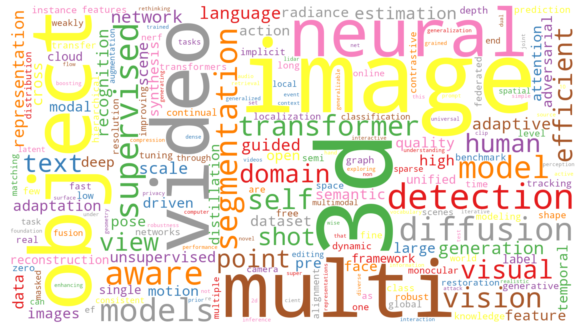

# ICCV2023-Papers-with-Code

### 【📣 ICCV 2023录用论文列表发布了！】

> 注0：欢迎各位同学Star，分享ICCV-2023的Paper和Code！
>
> 注1：历年ICCV论文汇总，详见： https://github.com/TensorLabX/ICCV2025-PapersWithCode
>

***

欢迎扫码关注公众号【**Tensor实验室**】，获取最新**大模型、具身智能、CV、扩散模型、多模态、自动驾驶、医疗影像、AIGC、遥感等方向的论文解读、发展趋势和学习资料**，赶快加入一起学习吧！

## AI垂直方向交流群和论文投稿群已成立！

## 👨‍🔧👩‍🔧👨‍🔬👩‍🔬👨‍🚀👨‍🚒🕵️‍: 欢迎进群 | Welcome

目前已经开设的AI细分垂直方向交流群包括但不限于：**大模型、多模态、具身智能、CV、扩散模型、目标检测、图像分割、目标跟踪、医学影像、遥感、3DGS、Mamba、NeRF、Transformer、GAN、异常检测/缺陷检测、SLAM、人脸检测&识别、OCR、NAS、Re-ID、超分辨率、强化学习、3D重建、姿态估计、自动驾驶、活体检测、深度估计、去噪、显著性目标检测、车道线检测、模型剪枝&压缩、去雾、去雨、行为识别、视频理解、图像融合、图像检索等**。

可以添加微信小助手微信：**Tensor333**或**Tensor555**，请备注：**研究方向+地区+学校/公司名称+昵称**！如：**大模型+北京+北航+小北**；一定要根据格式申请，可以拉你进对应的交流群。

**如果目前方向未定的的同学，可以先加入大群（大群和垂直方向群可以同时加入）**。可以添加微信小助手微信：**Tensor333**或**Tensor555**，请备注：**方向未定+地区+学校/公司名称+昵称**！如：**方向未定+北京+北航+小北**；

***
**如果想进顶刊顶会论文投稿和交流群的同学。**可以添加微信小助手微信：**Tensor333**或**Tensor555**，请备注：**顶刊顶会名称+地区+学校/公司名称+昵称**！如：**CVPR+北京+北航+小北**；
***

## 📙: **【论文目录】**

# 【ICCV 2023 论文开源目录】

- [Backbone](#Backbone)
- [CLIP](#CLIP)
- [MAE](#MAE)
- [GAN](#GAN)
- [GNN](#GNN)
- [MLP](#MLP)
- [NAS](#NAS)
- [OCR](#OCR)
- [NeRF](#NeRF)
- [DETR](#DETR)
- [Prompt](#Prompt)
- [Diffusion Models(扩散模型)](#Diffusion)
- [Prompt](#Prompt)
- [Avatars](#Avatars)
- [ReID(重识别)](#ReID)
- [长尾分布(Long-Tail)](#Long-Tail)
- [Vision Transformer](#Vision-Transformer)
- [视觉和语言(Vision-Language)](#VL)
- [自监督学习(Self-supervised Learning)](#SSL)
- [数据增强(Data Augmentation)](#DA)
- [目标检测(Object Detection)](#Object-Detection)
- [目标跟踪(Visual Tracking)](#VT)
- [语义分割(Semantic Segmentation)](#Semantic-Segmentation)
- [实例分割(Instance Segmentation)](#Instance-Segmentation)
- [全景分割(Panoptic Segmentation)](#Panoptic-Segmentation)
- [医学图像分类(Medical Image Classfication)](#MIC)
- [医学图像分割(Medical Image Segmentation)](#MIS)
- [视频目标分割(Video Object Segmentation)](#VOS)
- [视频实例分割(Video Instance Segmentation)](#VIS)
- [参考图像分割(Referring Image Segmentation)](#RIS)
- [图像抠图(Image Matting)](#Matting)
- [Low-level Vision](#LLV)
- [超分辨率(Super-Resolution)](#SR)
- [去噪(Denoising)](#Denoising)
- [去模糊(Deblur)](#Deblur)
- [3D点云(3D Point Cloud)](#3D-Point-Cloud)
- [3D目标检测(3D Object Detection)](#3DOD)
- [3D语义分割(3D Semantic Segmentation)](#3DSS)
- [3D目标跟踪(3D Object Tracking)](#3D-Object-Tracking)
- [3D语义场景补全(3D Semantic Scene Completion)](#3DSSC)
- [3D配准(3D Registration)](#3D-Registration)
- [3D人体姿态估计(3D Human Pose Estimation)](#3D-Human-Pose-Estimation)
- [3D人体Mesh估计(3D Human Mesh Estimation)](#3D-Human-Pose-Estimation)
- [医学图像(Medical Image)](#Medical-Image)
- [图像生成(Image Generation)](#Image-Generation)
- [视频生成(Video Generation)](#Video-Generation)
- [图像编辑(Image Editing)](#Image-Editing)
- [视频编辑(Video Editing)](#Video-Editing)
- [视频理解(Video Understanding)](#Video-Understanding)
- [人体运动生成(Human Motion Generation)](#Human-Motion-Generation)
- [低光照图像增强(Low-light Image Enhancement)](#Low-light-Image-Enhancement)
- [场景文本识别(Scene Text Recognition)](#STR)
- [图像检索(Image Retrieval)](#Image-Retrieval)
- [图像融合(Image Fusion)](#Image-Fusion)
- [轨迹预测(Trajectory Prediction) ](#Trajectory-Prediction)
- [人群计数(Crowd Counting)](#Crowd-Counting)
- [Video Quality Assessment(视频质量评价)](#Video-Quality-Assessment)
- [其它(Others)](#Others)

# Avatars 

**Transforming Text into Neural Human Avatars with Parameterized Shape and Pose Control**

Paper: https://arxiv.org/abs/2303.17606

Code: https://github.com/songrise/AvatarCraft

# Backbone

**Rethinking Mobile Block for Efficient Attention-based Models**

- Paper: https://arxiv.org/abs/2301.01146
- Code: https://github.com/zhangzjn/EMO 

# CLIP

**PromptStyler: Prompt-driven Style Generation for Source-free Domain Generalization**

- Paper: https://arxiv.org/abs/2307.15199
- Code: [https://PromptStyler.github.io/](https://promptstyler.github.io/)

**CLIPTrans: Transferring Visual Knowledge with Pre-trained Models for Multimodal Machine Translation**

- Paper: https://arxiv.org/abs/2308.15226
- Code: http://www.github.com/devaansh100/CLIPTrans

# NeRF

**IntrinsicNeRF: Learning Intrinsic Neural Radiance Fields for Editable Novel View Synthesis**

- Homepage: https://zju3dv.github.io/intrinsic_nerf/
- Paper: https://arxiv.org/abs/2210.00647
- Code: https://github.com/zju3dv/IntrinsicNeRF

**Transforming Text into Neural Human Avatars with Parameterized Shape and Pose Control**

- Paper: https://arxiv.org/abs/2303.17606

- Code: https://github.com/songrise/AvatarCraft

**FlipNeRF: Flipped Reflection Rays for Few-shot Novel View Synthesis**

- Homepage: https://shawn615.github.io/flipnerf/
- Code: https://github.com/shawn615/FlipNeRF
- Paper: https://arxiv.org/abs/2306.17723

**Tri-MipRF: Tri-Mip Representation for Efficient Anti-Aliasing Neural Radiance Fields**

- Homepage: https://wbhu.github.io/projects/Tri-MipRF

- Paper: https://arxiv.org/abs/2307.11335
- Code: https://github.com/wbhu/Tri-MipRF

# Diffusion Models(扩散模型)

**PoseDiffusion: Solving Pose Estimation via Diffusion-aided Bundle Adjustment**

- Paper: https://arxiv.org/abs/2306.15667
- Code: https://github.com/facebookresearch/PoseDiffusion

**FreeDoM: Training-Free Energy-Guided Conditional Diffusion Model**

- Paper: https://arxiv.org/abs/2303.09833
- Code: https://github.com/vvictoryuki/FreeDoM

**BoxDiff: Text-to-Image Synthesis with Training-Free Box-Constrained Diffusion**

- Paper: https://arxiv.org/abs/2307.10816
- Code: https://github.com/Sierkinhane/BoxDiff

**BeLFusion: Latent Diffusion for Behavior-Driven Human Motion Prediction**

- Paper: https://arxiv.org/abs/2211.14304
- Code: https://github.com/BarqueroGerman/BeLFusion

**DDFM: Denoising Diffusion Model for Multi-Modality Image Fusion**

- Paper: https://arxiv.org/abs/2303.06840
- Code: https://github.com/Zhaozixiang1228/MMIF-DDFM

**DIRE for Diffusion-Generated Image Detection**

- Paper: https://arxiv.org/abs/2303.09295
- Code: https://github.com/ZhendongWang6/DIRE

# Prompt

**Read-only Prompt Optimization for Vision-Language Few-shot Learning** 

- Paper: https://arxiv.org/abs/2308.14960
- Code: https://github.com/mlvlab/RPO

**Introducing Language Guidance in Prompt-based Continual Learning**

- Paper: https://arxiv.org/abs/2308.15827
- Code: None

# 视觉和语言(Vision-Language)

**Read-only Prompt Optimization for Vision-Language Few-shot Learning** 

- Paper: https://arxiv.org/abs/2308.14960
- Code: https://github.com/mlvlab/RPO

# 目标检测(Object Detection)

**Femtodet: an object detection baseline for energy versus performance tradeoffs**

- Paper: https://arxiv.org/abs/2301.06719
- Code: https://github.com/yh-pengtu/FemtoDet

**Group DETR: Fast DETR Training with Group-Wise One-to-Many Assignment**

- Paper: https://arxiv.org/abs/2207.13085
- Code: https://github.com/Atten4Vis/GroupDETR

**Integrally Migrating Pre-trained Transformer Encoder-decoders for Visual Object Detection**

- Paper: https://arxiv.org/abs/2205.09613
- Code: https://github.com/LiewFeng/imTED

**ASAG: Building Strong One-Decoder-Layer Sparse Detectors via Adaptive Sparse Anchor Generation**

- Paper: https://arxiv.org/abs/2308.09242
- Code: https://github.com/iSEE-Laboratory/ASAG

# 目标跟踪(Visual Tracking)

**Cross-modal Orthogonal High-rank Augmentation for RGB-Event Transformer-trackers**

- Paper: https://arxiv.org/abs/2307.04129
- Code: https://github.com/ZHU-Zhiyu/High-Rank_RGB-Event_Tracker 

# 语义分割(Semantic Segmentation)

**Segment Anything**

- Homepage: https://segment-anything.com/
- Paper: https://arxiv.org/abs/2304.02643
- Code: https://github.com/facebookresearch/segment-anything

**MARS: Model-agnostic Biased Object Removal without Additional Supervision for Weakly-Supervised Semantic Segmentation**

- Paper: https://arxiv.org/abs/2304.09913
- Code: https://github.com/shjo-april/MARS

**FreeCOS: Self-Supervised Learning from Fractals and Unlabeled Images for Curvilinear Object Segmentation**

- Paper: https://arxiv.org/abs/2307.07245
- Code: https://github.com/TY-Shi/FreeCOS

**Residual Pattern Learning for Pixel-wise Out-of-Distribution Detection in Semantic Segmentation**

- Paper: https://arxiv.org/abs/2211.14512
- Code: https://github.com/yyliu01

**Disentangle then Parse:Night-time Semantic Segmentation with Illumination Disentanglement**

- Paper: https://arxiv.org/abs/2307.09362
- Code: https://github.com/w1oves/DTP

# 视频目标分割(Video Object Segmentation)

**Towards Robust Referring Video Object Segmentation with Cyclic Relational Consensus**

- Paper: https://arxiv.org/abs/2207.01203 

- Code: https://github.com/lxa9867/R2VOS

# 视频实例分割(Video Instance Segmentation)

**DVIS: Decoupled Video Instance Segmentation Framework**

- Paper: https://arxiv.org/abs/2306.03413
- Code: https://github.com/zhang-tao-whu/DVIS

# 医学图像分类

**BoMD: Bag of Multi-label Descriptors for Noisy Chest X-ray Classification**

- Paper: https://arxiv.org/abs/2203.01937

- Code: https://github.com/cyh-0/BoMD

# 医学图像分割

**CLIP-Driven Universal Model for Organ Segmentation and Tumor Detection**

- Paper: https://arxiv.org/abs/2301.00785
- Code: https://github.com/ljwztc/CLIP-Driven-Universal-Model

# Low-level Vision

**Self-supervised Learning to Bring Dual Reversed Rolling Shutter Images Alive**

- Paper: https://arxiv.org/abs/2305.19862
- Code: https://github.com/shangwei5/SelfDRSC 

# 超分辨率(Super-Resolution)

**Spherical Space Feature Decomposition for Guided Depth Map Super-Resolution.**

- Paper: https://arxiv.org/abs/2303.08942
- Code: https://github.com/Zhaozixiang1228/GDSR-SSDNet 

# 3D点云(3D Point Cloud)

**Robo3D: Towards Robust and Reliable 3D Perception against Corruptions**

- Homepage: https://ldkong.com/Robo3D
- Paper: https://arxiv.org/abs/2303.17597
- Code: https://github.com/ldkong1205/Robo3D

**Instance-aware Dynamic Prompt Tuning for Pre-trained Point Cloud Models**

- Paper: https://arxiv.org/abs/2304.07221
- Code: https://github.com/zyh16143998882/ICCV23-IDPT

**Point Contrastive Prediction with Semantic Clustering for Self-Supervised Learning on Point Cloud Videos**

- Paper: https://arxiv.org/abs/2308.09247
- Code: None

# 3D目标检测(3D Object Detection)

**PETRv2: A Unified Framework for 3D Perception from Multi-Camera Images**

- Paper: https://arxiv.org/abs/2206.01256
- Code: https://github.com/megvii-research/PETR

**DQS3D: Densely-matched Quantization-aware Semi-supervised 3D Detection**

- Paper: https://arxiv.org/abs/2304.13031
- Code: https://github.com/AIR-DISCOVER/DQS3D

**SparseFusion: Fusing Multi-Modal Sparse Representations for Multi-Sensor 3D Object Detection**

- Paper: https://arxiv.org/abs/2304.14340
- Code: https://github.com/yichen928/SparseFusion

**StreamPETR: Exploring Object-Centric Temporal Modeling for Efficient Multi-View 3D Object Detection**

- Paper: https://arxiv.org/abs/2303.11926
- Code: https://github.com/exiawsh/StreamPETR.git

**Cross Modal Transformer: Towards Fast and Robust 3D Object Detection**

- Paper: https://arxiv.org/abs/2301.01283
- Code: https://github.com/junjie18/CMT.git

**MetaBEV: Solving Sensor Failures for BEV Detection and Map Segmentation**

- Paper: https://arxiv.org/abs/2304.09801
- Project: https://chongjiange.github.io/metabev.html
- Code: https://github.com/ChongjianGE/MetaBEV

**Revisiting Domain-Adaptive 3D Object Detection by Reliable, Diverse and Class-balanced Pseudo-Labeling**

- Paper: https://arxiv.org/abs/2307.07944
- Code: https://github.com/zhuoxiao-chen/ReDB-DA-3Ddet

**SA-BEV: Generating Semantic-Aware Bird's-Eye-View Feature for Multi-view 3D Object Detection**

- Paper: https://arxiv.org/abs/2307.11477
- Code: https://github.com/mengtan00/SA-BEV

# 3D语义分割(3D Semantic Segmentation)

**Rethinking Range View Representation for LiDAR Segmentation**

- Homepage: https://ldkong.com/RangeFormer
- Paper: https://arxiv.org/abs/2303.05367
- Code: None

# 3D目标跟踪(3D Object Tracking)

**MBPTrack: Improving 3D Point Cloud Tracking with Memory Networks and Box Priors**

- Paper: https://arxiv.org/abs/2303.05071
- Code : https://github.com/slothfulxtx/MBPTrack3D

# 视频理解(Video Understanding)

**Unmasked Teacher: Towards Training-Efficient Video Foundation Models**

- Paper: https://arxiv.org/abs/2303.16058

- Code: https://github.com/OpenGVLab/unmasked_teacher

# 图像生成(Image Generation)

**FreeDoM: Training-Free Energy-Guided Conditional Diffusion Model**

- Paper: https://arxiv.org/abs/2303.09833
- Code: https://github.com/vvictoryuki/FreeDoM

**BoxDiff: Text-to-Image Synthesis with Training-Free Box-Constrained Diffusion**

- Paper: https://arxiv.org/abs/2307.10816
- Code: https://github.com/Sierkinhane/BoxDiff 

# 视频生成(Video Generation)

**Simulating Fluids in Real-World Still Images**

- Homepage: https://slr-sfs.github.io/ 
- Paper: https://arxiv.org/abs/2204.11335
- Code: https://github.com/simon3dv/SLR-SFS

# 图像编辑(Image Editing)

**Multimodal Garment Designer: Human-Centric Latent Diffusion Models for Fashion Image Editing**

- Paper: https://arxiv.org/abs/2304.02051
- Code: https://github.com/aimagelab/multimodal-garment-designer 

# 视频编辑(Video Editing)

**FateZero: Fusing Attentions for Zero-shot Text-based Video Editing**

- Project: https://fate-zero-edit.github.io/ 
- Paper: https://arxiv.org/abs/2303.09535
- Code: https://github.com/ChenyangQiQi/FateZero 

# 人体运动生成(Human Motion Generation)

**BeLFusion: Latent Diffusion for Behavior-Driven Human Motion Prediction**

- Paper: https://arxiv.org/abs/2211.14304
- Code: https://github.com/BarqueroGerman/BeLFusion 

# 低光照图像增强(Low-light Image Enhancement)

**Implicit Neural Representation for Cooperative Low-light Image Enhancement**

- Paper: https://arxiv.org/abs/2303.11722
- Code: https://github.com/Ysz2022/NeRCo

# 场景文本检测(Scene Text Detection)

# 场景文本识别(Scene Text Recognition)

**Self-supervised Character-to-Character Distillation for Text Recognition**

- Paper: https://arxiv.org/abs/2211.00288
- Code: https://github.com/TongkunGuan/CCD

**MRN: Multiplexed Routing Network for Incremental Multilingual Text Recognition**

- Paper: https://arxiv.org/abs/2305.14758
- Code: https://github.com/simplify23/MRN
- 中文解读：https://zhuanlan.zhihu.com/p/643948935 

# 图像检索(Image Retrieval)

**Zero-Shot Composed Image Retrieval with Textual Inversion**

- Paper: https://arxiv.org/abs/2303.15247
- Code: https://github.com/miccunifi/SEARLE 

# 图像融合(Image Fusion)

**DDFM: Denoising Diffusion Model for Multi-Modality Image Fusion**

- Paper: https://arxiv.org/abs/2303.06840
- Code: https://github.com/Zhaozixiang1228/MMIF-DDFM

# 轨迹预测(Trajectory Prediction)

**EigenTrajectory: Low-Rank Descriptors for Multi-Modal Trajectory Forecasting**

- Homepage: https://inhwanbae.github.io/publication/eigentrajectory/

- Paper: https://arxiv.org/abs/2307.09306 
- Code: https://github.com/InhwanBae/EigenTrajectory

# 人群计数(Crowd Counting)

**Point-Query Quadtree for Crowd Counting, Localization, and More**

- Paper: https://arxiv.org/abs/2308.13814
- Code: https://github.com/cxliu0/PET

# Video Quality Assessment(视频质量评价)

**Exploring Video Quality Assessment on User Generated Contents from Aesthetic and Technical Perspectives**

- Paper: https://arxiv.org/abs/2211.04894
- Code: https://github.com/VQAssessment/DOVER

# 其它(Others)

**MotionBERT: A Unified Perspective on Learning Human Motion Representations**

- Homepage: https://motionbert.github.io/
- Paper: https://arxiv.org/abs/2210.06551
- Code: https://github.com/Walter0807/MotionBERT 

**Graph Matching with Bi-level Noisy Correspondence**

- Paper: https://arxiv.org/pdf/2212.04085.pdf
- Code: https://github.com/Lin-Yijie/Graph-Matching-Networks/tree/main/COMMON 

**LDL: Line Distance Functions for Panoramic Localization**

- Paper: https://arxiv.org/abs/2308.13989
- Code: https://github.com/82magnolia/panoramic-localization

**Active Neural Mapping**

- Homepage: https://zikeyan.github.io/active-INR/index.html
- Paper: https://arxiv.org/abs/2308.16246
- Code: https://zikeyan.github.io/active-INR/index.html#

**Reconstructing Groups of People with Hypergraph Relational Reasoning**

- Paper: https://arxiv.org/abs/2308.15844
- Code: https://github.com/boycehbz/GroupRec