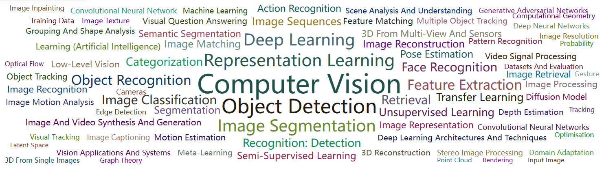

# ICCV2025-Papers-with-Code

> 注0：欢迎各位同学Star，分享ICCV-2025的Paper和Code！
>
> 注1：历年ICCV论文汇总，详见： https://github.com/TensorLabX/ICCV2025-PapersWithCode
>

***

欢迎扫码关注公众号【**Tensor实验室**】，获取最新**大模型、具身智能、CV、扩散模型、多模态、自动驾驶、医疗影像、AIGC、遥感等方向的论文解读、发展趋势和学习资料**，赶快加入一起学习吧！

## AI垂直方向交流群和论文投稿群已成立！

## 👨‍🔧👩‍🔧👨‍🔬👩‍🔬👨‍🚀👨‍🚒🕵️‍: 欢迎进群 | Welcome

目前已经开设的AI细分垂直方向交流群包括但不限于：**大模型、多模态、具身智能、CV、扩散模型、目标检测、图像分割、目标跟踪、医学影像、遥感、3DGS、Mamba、NeRF、Transformer、GAN、异常检测/缺陷检测、SLAM、人脸检测&识别、OCR、NAS、Re-ID、超分辨率、强化学习、3D重建、姿态估计、自动驾驶、活体检测、深度估计、去噪、显著性目标检测、车道线检测、模型剪枝&压缩、去雾、去雨、行为识别、视频理解、图像融合、图像检索等**。

可以添加微信小助手微信：**Tensor333**或**Tensor555**，请备注：**研究方向+地区+学校/公司名称+昵称**！如：**大模型+北京+北航+小北**；一定要根据格式申请，可以拉你进对应的交流群。

**如果目前方向未定的的同学，可以先加入大群（大群和垂直方向群可以同时加入）**。可以添加微信小助手微信：**Tensor333**或**Tensor555**，请备注：**方向未定+地区+学校/公司名称+昵称**！如：**方向未定+北京+北航+小北**；

***
**如果想进顶刊顶会论文投稿和交流群的同学。**可以添加微信小助手微信：**Tensor333**或**Tensor555**，请备注：**顶刊顶会名称+地区+学校/公司名称+昵称**！如：**CVPR+北京+北航+小北**；
***

## 📙: **【论文目录】**

# 【ICCV 2025 论文开源目录】
- [Agent](#Agent)
- [Avatars](#Avatars)
- [Backbone](#Backbone)
- [CLIP](#CLIP)
- [Diffusion Models(扩散模型)](#Diffusion)
- [Embodied AI](#Embodied-AI)
- [MAE](#MAE)
- [Mamba](#Mamba)
- [GAN](#GAN)
- [GNN](#GNN)
- [MLP](#MLP)
- [NAS](#NAS)
- [OCR](#OCR)
- [NeRF](#NeRF)
- [DETR](#DETR)
- [Prompt](#Prompt)
- [ReID(重识别)](#ReID)
- [长尾分布(Long-Tail)](#Long-Tail)
- [多模态大语言模型(MLLM)](#MLLM)
- [大语言模型(LLM)](#LLM)
- [世界模型(World Model)](#WM)
- [Vision Transformer](#Vision-Transformer)
- [视觉和语言(Vision-Language)](#VL)
- [自监督学习(Self-supervised Learning)](#SSL)
- [数据增强(Data Augmentation)](#DA)
- [目标检测(Object Detection)](#Object-Detection)
- [目标跟踪(Visual Tracking)](#VT)
- [语义分割(Semantic Segmentation)](#Semantic-Segmentation)
- [实例分割(Instance Segmentation)](#Instance-Segmentation)
- [全景分割(Panoptic Segmentation)](#Panoptic-Segmentation)
- [医学图像分类(Medical Image Classfication)](#MIC)
- [医学图像分割(Medical Image Segmentation)](#MIS)
- [视频目标分割(Video Object Segmentation)](#VOS)
- [视频实例分割(Video Instance Segmentation)](#VIS)
- [参考图像分割(Referring Image Segmentation)](#RIS)
- [图像抠图(Image Matting)](#Matting)
- [Low-level Vision](#LLV)
- [超分辨率(Super-Resolution)](#SR)
- [去噪(Denoising)](#Denoising)
- [去模糊(Deblur)](#Deblur)
- [3DGS(Gaussian Splatting)](#3DGS)
- [3D点云(3D Point Cloud)](#3D-Point-Cloud)
- [3D目标检测(3D Object Detection)](#3DOD)
- [3D语义分割(3D Semantic Segmentation)](#3DSS)
- [3D目标跟踪(3D Object Tracking)](#3D-Object-Tracking)
- [3D语义场景补全(3D Semantic Scene Completion)](#3DSSC)
- [3D配准(3D Registration)](#3D-Registration)
- [3D人体姿态估计(3D Human Pose Estimation)](#3D-Human-Pose-Estimation)
- [3D人体Mesh估计(3D Human Mesh Estimation)](#3D-Human-Pose-Estimation)
- [医学图像(Medical Image)](#Medical-Image)
- [图像生成(Image Generation)](#Image-Generation)
- [视频生成(Video Generation)](#Video-Generation)
- [图像编辑(Image Editing)](#Image-Editing)
- [视频编辑(Video Editing)](#Video-Editing)
- [视频理解(Video Understanding)](#Video-Understanding)
- [人体运动生成(Human Motion Generation)](#Human-Motion-Generation)
- [低光照图像增强(Low-light Image Enhancement)](#Low-light-Image-Enhancement)
- [场景文本识别(Scene Text Recognition)](#STR)
- [图像检索(Image Retrieval)](#Image-Retrieval)
- [图像融合(Image Fusion)](#Image-Fusion)
- [轨迹预测(Trajectory Prediction) ](#Trajectory-Prediction)
- [人群计数(Crowd Counting)](#Crowd-Counting)
- [文本检测(Text Detection)](#Text-Detection)
- [知识蒸馏(Knowledge Distillation)](#KD)
- [模型剪枝(Model Pruning)](#Pruning)
- [图像压缩(Image Compression)](#IC)
- [三维重建(3D Reconstruction)](#3D-Reconstruction)
- [深度估计(Depth Estimation)](#Depth-Estimation)
- [轨迹预测(Trajectory Prediction)](#TP)
- [车道线检测(Lane Detection)](#Lane-Detection)
- [图像描述(Image Captioning)](#Image-Captioning)
- [视觉问答(Visual Question Answering)](#VQA)
- [手语识别(Sign Language Recognition)](#SLR)
- [视频预测(Video Prediction)](#Video-Prediction)
- [新视点合成(Novel View Synthesis)](#NVS)
- [Zero-Shot Learning(零样本学习)](#ZSL)
- [立体匹配(Stereo Matching)](#Stereo-Matching)
- [特征匹配(Feature Matching)](#Feature-Matching)
- [暗光图像增强(Low-light Image Enhancement)](#Low-light)
- [场景图生成(Scene Graph Generation)](#SGG)
- [风格迁移(Style Transfer)](#ST)
- [隐式神经表示(Implicit Neural Representations)](#INR)
- [图像质量评价(Image Quality Assessment)](#IQA)
- [视频质量评价(Video Quality Assessment)](#Video-Quality-Assessment)
- [压缩感知(Compressive Sensing)](#CS)
- [数据集(Datasets)](#Datasets)
- [新任务(New Tasks)](#New-Tasks)
- [Video Quality Assessment(视频质量评价)](#Video-Quality-Assessment)
- [其它(Others)](#Others)

# Agent

# Avatars

# Backbone

**TinyViM: Frequency Decoupling for Tiny Hybrid Vision Mamba**

- Paper: https://arxiv.org/abs/2411.17473
- Code: https://github.com/xwmaxwma/TinyViM

# CLIP

# Mamba

**TinyViM: Frequency Decoupling for Tiny Hybrid Vision Mamba**

- Paper: https://arxiv.org/abs/2411.17473
- Code: https://github.com/xwmaxwma/TinyViM

**Vamba: Understanding Hour-Long Videos with Hybrid Mamba-Transformers**

- Project：https://tiger-ai-lab.github.io/Vamba/
- Paper：https://arxiv.org/abs/2503.11579
- Code：https://github.com/TIGER-AI-Lab/Vamba

# Embodied AI

# GAN

# OCR

# NeRF

# DETR

# Prompt

# 多模态大语言模型(MLLM)

**FALCON: Resolving Visual Redundancy and Fragmentation in High-resolution Multimodal Large Language Models via Visual Registers**

- Paper: https://arxiv.org/abs/2501.16297
- Code: https://github.com/JiuTian-VL/JiuTian-FALCON
- Project: https://jiutian-vl.github.io/FALCON.github.io/

# 大语言模型(LLM)

# World Model(世界模型)

**Medical World Model: Generative Simulation of Tumor Evolution for Treatment Planning**

- Project: https://yijun-yang.github.io/MeWM/
- Paper: https://arxiv.org/abs/2506.02327
- Code: https://github.com/scott-yjyang/MeWM

# ReID(重识别)

# 扩散模型(Diffusion Models)

**Modeling Human Gaze Behavior with Diffusion Models for Unified Scanpath Prediction**
- Paper: https://arxiv.org/abs/2507.23021
- Code： https://github.com/aimagelab/ScanDiff
- Home：https://aimagelab.github.io/ScanDiff/

**From Reusing to Forecasting: Accelerating Diffusion Models with TaylorSeers**

- Paper: https://arxiv.org/abs/2503.06923
- Code: https://github.com/Shenyi-Z/TaylorSeer

**Text Embedding Knows How to Quantize Text-Guided Diffusion Models**
- Paper: 
- Code: https://github.com/jimmy9704/QLIP

# Vision Transformer

# 视觉和语言(Vision-Language)

# 目标检测(Object Detection)

# 异常检测(Anomaly Detection)

# 目标跟踪(Object Tracking)

# 医学图像(Medical Image)

**Medical World Model: Generative Simulation of Tumor Evolution for Treatment Planning**

- Project: https://yijun-yang.github.io/MeWM/
- Paper: https://arxiv.org/abs/2506.02327
- Code: https://github.com/scott-yjyang/MeWM

# 医学图像分割(Medical Image Segmentation)

# 自动驾驶(Autonomous Driving)

**Where, What, Why: Towards Explainable Driver Attention Prediction**

- Paper: https://arxiv.org/abs/2506.23088
- Code: https://github.com/yuchen2199/Explainable-Driver-Attention-Prediction
- Project: https://github.com/yuchen2199/Explainable-Driver-Attention-Prediction

**ROADWork Dataset: Learning to Recognize, Observe, Analyze and Drive Through Work Zones**

- Paper: https://arxiv.org/abs/2406.07661
- Code: https://github.com/anuragxel/roadwork-dataset
- Project: https://www.cs.cmu.edu/~ILIM/roadwork_dataset/

**DriveMM: All-in-One Large Multimodal Model for Autonomous Driving**

- Project: https://zhijian11.github.io/DriveMM/
- Paper: https://arxiv.org/abs/2412.07689
- Code: https://github.com/zhijian11/DriveMM

# 3DGS(Gaussian Splatting)
**6DOPE-GS: Online 6D Object Pose Estimation using Gaussian Splatting**
- Paper: https://arxiv.org/pdf/2412.01543
- Code: 
- Home: https://pearl-robot-lab.github.io/6dope-gs/

**STD-GS: Exploring Frame-Event Interaction for SpatioTemporal-Disentangled Gaussian Splatting to Reconstruct High-Dynamic Scene**
- Paper: https://hyzhouboy.github.io/
- Code: 

# 3D点云(3D-Point-Cloud)

# 3D目标检测(3D Object Detection)

# 3D语义分割(3D Semantic Segmentation)

# 3D语义场景补全(3D Semantic Scene Completion)
**WonderPlay: Dynamic 3D Scene Generation from a Single Image and Actions**
- Paper: https://arxiv.org/abs/2505.18151
- Code:
- Home: https://kyleleey.github.io/WonderPlay/

# Low-level Vision

**EAMamba: Efficient All-Around Vision State Space Model for Image Restoration**

- Paper: https://arxiv.org/abs/2506.22246
- Code: https://github.com/daidaijr/EAMamba

# 超分辨率(Super-Resolution)

# 去噪(Denoising)

## 图像去噪(Image Denoising)

# 3D人体姿态估计(3D Human Pose Estimation)

#3D Visual Grounding(3D视觉定位)

# 图像生成(Image Generation)

**DreamRenderer: Taming Multi-Instance Attribute Control in Large-Scale Text-to-Image Models**

- Paper: https://github.com/limuloo/DreamRenderer
- Code: https://arxiv.org/abs/2503.12885

**LOTS of Fashion! Multi-Conditioning for Image Generation via Sketch-Text Pairing**
- Paper: https://arxiv.org/abs/2507.22627
- Code: 
- Home: https://intelligolabs.github.io/lots/

# 视频生成(Video Generation)

# 图像编辑(Image Editing)

**Rethinking the Spatial and Temporal Redundancy for Efficient Image Editing**

- Project: https://eff-edit.github.io
- Paper: https://arxiv.org/abs/2503.10270
- Code: https://github.com/yuriYanZeXuan/EEdit

# 视频编辑(Video Editing)

# 3D生成(3D Generation)

# 3D重建(3D Reconstruction)

# 人体运动生成(Human Motion Generation)

# 视频理解(Video Understanding)

**Vamba: Understanding Hour-Long Videos with Hybrid Mamba-Transformers**

- Project：https://tiger-ai-lab.github.io/Vamba/
- Paper：https://arxiv.org/abs/2503.11579
- Code：https://github.com/TIGER-AI-Lab/Vamba

# 具身智能(Embodied AI)

# 知识蒸馏(Knowledge Distillation)

# 深度估计(Depth Estimation)

# 立体匹配(Stereo Matching)

# 暗光图像增强(Low-light Image Enhancement)

# 图像压缩(Image Compression)](#IC)

# 场景图生成(Scene Graph Generation)

# 风格迁移(Style Transfer)

#  场景图生成(Scene Graph Generation)
- Paper: https://arxiv.org/abs/2505.18151
- Code: 
- Home: https://kyleleey.github.io/WonderPlay/

# 图像质量评价(Image Quality Assessment)

# 视频质量评价(Video Quality Assessment)

# 压缩感知(Compressive Sensing)

# 数据集(Datasets)

**ROADWork Dataset: Learning to Recognize, Observe, Analyze and Drive Through Work Zones**

- Paper: https://arxiv.org/abs/2406.07661
- Code: https://github.com/anuragxel/roadwork-dataset
- Project: https://www.cs.cmu.edu/~ILIM/roadwork_dataset/

# 其他(Others)

**Music Grounding by Short Video**

- Project: https://rucmm.github.io/VMMR/
- Paper: https://arxiv.org/abs/2408.16990
- Code link: https://github.com/xxayt/MGSV

